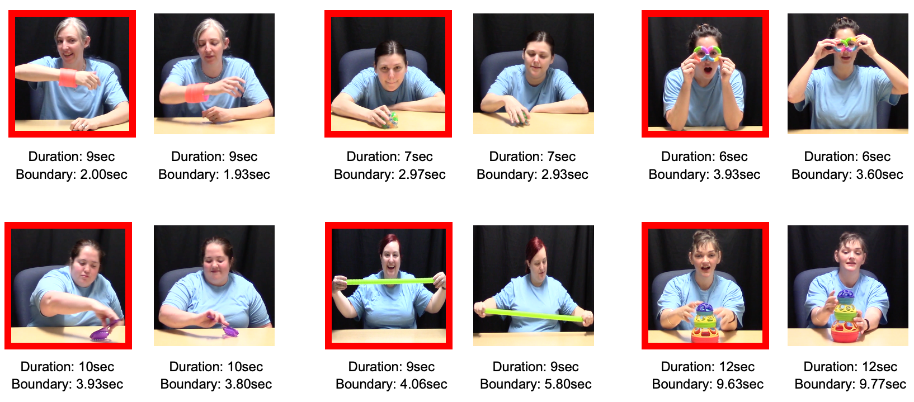

```{r setup, warning = FALSE}
library(papaja)
library(tidyverse)
library(lme4)
library(lmerTest)
library(here)
library(kableExtra)
library(knitr)
library(ggthemes)
library(dplyr)
library(viridis)

```

```{r analysis-preferences, include = FALSE}
# Seed for random number generation
set.seed(42)

knitr::opts_chunk$set(cache.extra = knitr::rand_seed, echo = FALSE, warning = FALSE, message = FALSE, cache = FALSE)

# make sure summary() uses Type III sums of squares
afex::set_sum_contrasts()

# turn off scientific notation
options(scipen = 999)

# set plot theme
theme_set(theme_bw(base_size = 10) + 
            theme(strip.background = element_blank(), 
                  panel.grid = element_blank())) # nice theme with limited extras


#read in the data
pdr_data <- read_csv("cleaned_data/cleaned_pdr_data.csv", col_types = cols(region_1s = col_factor()))
looking_data <- read_csv("cleaned_data/cleaned_looking_data.csv")
```

Human activity generates a motion stream that is both complex and rapidly unfolding. Making sense of this dynamically streaming sensory information is a challenging cognitive enterprise; actions must be discerned “on the fly” as information flows past. The ability to find the internal, segmental structure within continuously unfolding activity (i.e., where individual units of action begin and end) is a key skill that is linked to fluency across domains including event comprehension [e.g., @newtson_engquist_1976], learning [@bailey_2013], memory [@sonne_2016; @sonne_2017; @sargent_2013; @flores_2017; @swallow_2009], social understanding [@baldwin_baird_2001; @zalla_2013], and language acquisition [@baldwin_2005; @levine_2018]. Early in life, infants seem to have acquired the ability to find segmental structure in at least some kinds of activity sequences (see @levine_2018 for a review). Less is known about how infants rise to the challenge of detecting this structure as they first encounter novel action and watch it rapidly unfold.

It is important to consider, however, that infants are often not alone as they face this challenge. For example, in interactions with infants, caregivers modify their behaviors in a variety of ways that engage infants’ attention and facilitate learning [e.g., @brand_2002; @fernald_1985; @csibra_gergely_2009]. It seems likely that caregivers’ modifications to infant-directed action [e.g., “motionese;” @brand_2002] could help infants find structure as activity unfolds [@nagai_rohlfing_2007, @nagai_rohlfing_2009], including segmental structure in particular. As yet this hypothesis has not been put to direct test. In the present research, we used a novel, open-source, inexpensive, and infant-friendly system for measuring infants’ pupillary response [the Stimulus-Induced Pupil Response (SIPR) system; Patent Pending; @bala_2016] to explore the extent to which motionese influences infants’ ability to detect the segmental structure within action as activity unfolds across time.

In what follows, we briefly summarize what is currently known about infants’ action segmentation skills, as well as initial evidence that caregivers scaffold infants’ processing of human action. Finally, we describe a body of evidence indicating that pupillometry offers potential insight into infants’ processing of segmental structure within dynamic action. 

## Action segmentation in infancy
A growing literature suggests that action segmentation processes are operative early in life (see @levine_2018 for a recent review). In particular, infants display sensitivity to segmental structure in a variety of everyday intentional-action sequences [@baldwin_2001; @hespos_2009; @hespos_2010; @saylor_2007]. For example, Baldwin and colleagues [-@baldwin_2001] familiarized 10- and 11-month-old infants to a video depicting an actor engaging in a series of everyday activities. At test, infants were shown the same videos with pauses of identical length at either action boundaries (i.e., the region within behavior at which one action ends and the next begins, such as the moment at which an actor grasps an object to pick it up) or at non-boundary junctures. Infants looked longer to the test videos that depicted pauses at non-boundary junctures, suggesting that they readily detect structure in unfolding intentional action, parse human behavior with respect to this structure, and are surprised when this structure is violated.

As well, action boundaries appear to hold privileged status in older infants’ processing of events [@sonne_2016; @sonne_2017], which implies sensitivity to segmental structure. For example, Sonne and colleagues [-@sonne_2017] found that, at a delay of ten minutes after viewing, 21-month-old infants more accurately remembered specific objects that had been presented at action boundaries than those presented at non-boundary junctures. Apparently, infants, like adults [e.g., @hard_2011; @kosie_baldwin_2019; @kurby_zacks_2008], selectively attend to boundaries within unfolding activity. Just how infants begin to find action boundaries within dynamically unfolding activity sequences remains an open question, however.

On the one hand, statistical learning appears to facilitate infants’ detection of such structure in action. Several lines of evidence suggest that infants can track regularities within dynamic action to guide processing of the unfolding activity [e.g., @ambrosini_2013; @kanakogi_itakura_2011; @monroy_2017; @nagai_2019]. In particular, infants can capitalize on statistical regularities embedded within novel activity sequences to discover segments within the unfolding stream that were initially opaque to them, relying on low-predictability transitions within the stream to define boundaries between action units [@baldwin_2012; @roseberry_2011; @stahl_2014]. Moreover, infants can use these regularities to guide anticipatory gaze on later occasions when viewing the same sequences [@monroy_2017]. However, it is unclear as yet how much, or what kind of, repeated exposure is necessary before the statistics of a given novel activity sequence can be learned and used to guide infants’ subsequent processing. In infants’ day-to-day experience, some contexts might serve to enhance these statistics, promoting infants’ identification of attention-worthy regions of activity (i.e., action boundaries), thereby supporting infants’ rapid acquisition of action-processing skill. One particular context that might be especially influential in this regard occurs when caregivers specifically attempt to demonstrate novel activities to infants.

## “Motionese” might scaffold infants’ detection of structure in action

When demonstrating novel action to infants, caregivers modify their behavior in a variety of systematic ways that seem well suited to promoting infants’ processing of the dynamic activity stream. Recent research investigating this phenomenon provides initial confirmation that infants benefit from such “motionese” demonstrations [@williamson_brand_2014]. It remains unclear, however, whether motionese specifically scaffolds infants’ detection of segmental structure within action, although this seems highly plausible.

A first study documenting motionese found that, when demonstrating novel objects to 6- to 13-month-old infants, caregivers exhibited increased interactiveness, proximity to their infant interactive partner, enthusiasm, range of motion, repetition, and simplicity in their actions [@brand_2002]. These modifications capture infants’ attention, in that infants prefer to watch action demonstrations in a motionese format over action characteristic of demonstrations directed toward adults [@brand_shallcross_2008]. Toddlers are also more likely to imitate actions demonstrated using motionese [@williamson_brand_2014], and use of motionese increases 8- to 10-month-old infants’ subsequent object exploration, which can have downstream benefits for overall learning [@koterba_iverson_2009].

The motionese modifications just summarized parallel modifications in language directed to infants, commonly called “motherese” [@snow_ferguson_1977], and are likely part of a suite of infant-directed modifications jointly constituting a natural pedagogy phenomenon that has received extensive investigation in the developmental literature [e.g., @sage_baldwin_2010; @csibra_gergely_2009]. Benefits of motherese in speech include facilitating infants’ attention [@fernald_1985; @manybabies_2020], enhancing infants’ processing of the acoustic and segmental properties of speech [@kuhl_2004], and promoting their detection of segmental structure within streams of fluent speech [@thiessen_2005; @kemlernelson_1989].

Given such findings regarding motherese, it seems highly plausible that motionese analogously promotes infants’ detection of segmental structure within dynamic action. In fact, certain documented features of motionese seem likely to specifically direct infants’ attention to action boundaries. For example, during object demonstrations to their 7- to 12-month-old infant, mothers’ infant-directed gaze is systematically aligned with boundary junctures [@brand_2013]. Features of mothers’ infant-directed speech during action demonstrations is often aligned with action boundaries as well. For example, the onset and offset of mothers’ action-describing speech tends to be aligned with boundaries occurring at the initiation or completion of an action unit [@meyer_2011; @hirshpasek_golinkoff_1996], and infants tend to group such packaged action into coherent “chunks” [@brand_tapscott_2007]. At action boundaries, mothers also tend to speak with rising or falling intonation, perhaps signaling the completion of an action unit [@rohlfing_2006]. Features such as repetition [@brand_2009] and turn taking [@brand_2007] in infant-directed demonstrations also coincide systematically with action boundaries, which might additionally facilitate infants’ attention to the segmental structure of unfolding activity.

All in all, current evidence strongly suggests that motionese may assist infants in detecting action boundaries within continuously flowing activity, which would facilitate learning and memory. As yet, however, the possibility that motionese scaffolds infants’ detection of segmental structure within streaming activity has not been put to direct test, largely because most methods used to investigate infant perception and cognition are not well-suited to the task. In particular, existing techniques for investigating infants’ action processing have typically been limited to first exposing infants to action sequences and then, at later test, measuring infants’ recognition/discrimination with respect to the stimuli that they previously viewed [e.g., @woodward_1998; @baldwin_2001; @stahl_2014). Fortunately, an increasingly popular technique - measuring ongoing involuntary changes in pupil diameter concomitant with cognitive engagement - provides a novel approach to exploring infants’ processing of unfolding action. This technique thus offers a novel window on ways in which motionese may scaffold such processing.

## Pupillometry as a promising solution

Pupil dilation response (hereafter PDR) occurs spontaneously with changes in luminance [@loewenfeld_1993] as well as in response to a variety of cognitive stimuli [@goldwater_1972; @sirois_brisson_2014; @laeng_2012]. Among other things, changes in pupil dilation are thought to reflect the attentional demands imposed by a cognitive task [@beatty_lucerowagoner_2000; @goldinger_papesh_2012]. In general, available findings provide strong confirmation of Kahneman’s [-@kahneman_1973] suggestion that pupil diameter provides an online indication of the “intensity of attention” being allocated by an observer. Infancy researchers are increasingly taking advantage of pupillometry to investigate infant cognition; infants’ PDR profiles have shown a range of similarities to those of adults’ [e.g.,@addyman_2014; @jackson_sirois_2009; @sirois_jackson_2012; @gredeback_melinder_2010; @hepach_westermann_2016; @zhang_2018).

Of particular relevance to the present research, one recent study provides evidence that adults display systematic pupil dilation in relation to the internal structure of activity sequences. Specifically, Tanaka, Kosie, & Baldwin [-@tanaka_inprep] presented adults with a series of short clips of sport activities, each containing one coarse-level action boundary (e.g., when the athlete completed the primary goal, such as “locking out” in a weight-lifting maneuver, or striking a ball with a racquet in a tennis serve). As predicted, systematic changes in pupil diameter occurred in time-locked relation to action boundaries. Adult viewers’ pupil size tended to increase immediately prior to action boundaries, peak at or shortly after boundaries, and return toward baseline over an extended period thereafter. Boundaries elicited this characteristic PDR pattern regardless of the particular time-point (early or late) at which they occurred within the unfolding event. As well, luminance properties of the unfolding activity sequences could not account for the findings; systematic boundary-related PDRs emerged even when controlling for luminance.

Based on this collection of findings, we opted to employ pupillometry to test for comparable boundary-related PDRs in infants, and more specifically, to compare possible boundary-related PDRs as infants viewed novel activity sequences in motionese versus adult-directed formats. We recruited infants in the 9-12 month age range, because prior research has documented both that caregivers produce motionese to infants of this age [@brand_2002], and that infants in this age range are known to be sensitive to the segmental structure of at least some everyday activity sequences [@baldwin_2001]. We addressed three main questions: 

(1) To what extent does infants’ previously-observed preference for “motionese” over adult-directed action replicate via pupillometry (in addition to standard looking-time measures as utilized in prior research)? 

(2) To what degree do infants spontaneously display systematic pupil-dilation response to action boundaries within streaming activity? 

(3) To what extent does motionese scaffold infants’ detection of action boundaries within continuous activity sequences relative to adult-directed action?

Regarding the first question, there is reason to suspect that motionese might elicit a general, overarching increase in pupil size in infants, relative to what adult-directed action induces. In pupillometry research, arousal manifests in increases in tonic (or sustained) pupil dilation [@kahneman_beatty_1966; @laeng_2012]. As well, such sustained increase in pupil size to highly arousing social stimuli has been observed across a variety of infant and preschooler studies [e.g., @hepach_2012; @hepach_2015; @martineau_2011; @geangu_2011; @nuske_2014; @nuske_2015]. We therefore predicted that the previously documented looking-time preference for motionese [@brand_shallcross_2008] would be reflected in an enhanced pupillary tonic to motionese action sequences relative to that observed in relation to the adult-directed action sequences. As a direct replication of previous research, we additionally measured infants’ looking time to motionese and adult-directed activity (i.e., how long infants looked at the videos). Again, we expected to replicate prior research, predicting that infants would look longer to motionese than adult-directed action sequences.

In relation to the second question, we hypothesized that infants, like adults, privilege action boundaries in their processing. We thus predicted that they would display a PDR in relation to action boundaries that they are able to detect. As described earlier, a substantial body of prior evidence indicates that, even in the absence of caregiver scaffolding, infants can register action boundaries in at least some kinds of simple, familiar activity sequences [@baldwin_2001; @saylor_2007; @hespos_2009; @hespos_2010]. A study by Jackson and Sirois [-@jackson_sirois_2009] provided incidental evidence highlighting the plausibility of this prediction. They measured pupil diameter as infants viewed a train repeatedly entering and exiting a tunnel; infants’ pupil dilation profiles displayed clear signs of a systematic PDR to the juncture at which the train exited the tunnel (a juncture adults would likely judge to be an action boundary). Importantly, their findings could not be explained by a change in luminance alone. Although investigating infants’ PDR to action boundaries was not the focus of their research, their results nevertheless seem to provide suggestive evidence that infants exhibit a PDR in response to action boundaries, thereby increasing our confidence in predicting that infants would display a systematic PDR to action boundaries in human activity streams. We note, however, that the activity streams we presented to infants in the present research were relatively novel for infants, introducing some uncertainty into whether they would be able to detect segmental structure within the dynamic flow of action.

Concerning the third question, we hypothesized that motionese facilitates infants’ detection of action boundaries. For this reason, we predicted that infants would display an enhanced boundary-related PDR for novel activity streams produced in motionese format, relative to adult-directed format. Evidence from the literatures regarding both motherese and motionese informed this prediction. Speech modifications that are characteristic of motherese have been shown to enhance infants’ ability to extract structure from dynamic streams of auditory stimuli [@thiessen_2005; @kemlernelson_1989]. On analogy with motherese, motionese also may highlight action boundaries (e.g., @brand_2013; @meyer_2011; @rohlfing_2006; @brand_2009; @brand_2007). We thus expected to find a similar facilitative effect of motionese on infants’ detection of action boundaries. That is, we suspected that infants might display a PDR to action boundaries even in the non-motionese condition, but that motionese would produce a synergistic effect whereby a boundary-related PDR would be larger when actions were demonstrated via motionese relative to adult-directed action. 

To summarize, we predicted (a) an overall attentional-enhancement effect of motionese, such that tonic pupil size would be larger for actions demonstrated via motionese relative to those displayed via adult-directed action, (b) phasic responses to action boundaries across both motionese and adult-directed demonstrations, but (c) larger phasic responses to action boundaries when actions were demonstrated in a motionese than an adult-directed format.


# Methods

```{r participant gender, include = FALSE}

participants <- read_csv("cleaned_data/participant_data.csv")

gender_ns <- participants %>% 
  group_by(sex_gender) %>% 
  count()

#clean up race column
participants <- participants %>% 
  separate(race, c("race1", "race2"))

race1_ns <- participants %>% 
  group_by(race1) %>% 
  count()

#create maternal education column
participants <- participants %>% 
  mutate(maternal_education = case_when(parent_a_sex_gender == "F" & parent_b_sex_gender == "M" ~ parent_a_education,
                                        parent_a_sex_gender == "M" & parent_b_sex_gender == "F" ~ parent_b_education,
                                      TRUE ~ "check_educ"),
         maternal_education = tolower(maternal_education))

maternal_ed <- participants %>% 
  group_by(maternal_education) %>% 
  count()

maternal_ed <- maternal_ed %>% 
  mutate(grad_training = case_when(maternal_education == "associates degree" ~ "N",
                                   maternal_education == "bachelor's degree" ~ "N",
                                   maternal_education == "check_educ" ~ "N", #because I checked
                                   maternal_education == "doctoral degree" ~ "Y",
                                   maternal_education == "j.d. (law)" ~ "Y",
                                   maternal_education == "master's degree" ~ "Y",
                                   maternal_education == "master's degree & juris doctorate" ~ "Y",
                                   maternal_education == "some college/university" ~ "N",
                                   TRUE ~ NA_character_))

grad_degree <- maternal_ed %>% 
  filter(grad_training == "Y") 


```
## Participants
Thirty-six infants ranging from 9 to 12 months (`r gender_ns$n[1]` females; Mean = `r round(mean(participants$age_days),2)` days; SD = `r round(sd(participants$age_days),2)` days) and their caregivers were recruited to participate from a database of community members with infants. Two infants were immediately excluded due to serious medical issues at birth. Race/ethnicity and maternal education level were representative of the local community; all participants (N = `r race1_ns$n[1]`; `r (race1_ns$n[1]/nrow(participants))*100`%) identified as White, `r length(na.omit(participants$race2))` participants (`r round(length(na.omit(participants$race2))/nrow(participants), 2)*100`%) additionally identified as another race/ethnicity, and `r round(sum(grad_degree$n)/nrow(participants),2)*100`% of mothers reported some level of graduate training. This research was approved by the University of Oregon IRB and parental informed consent was obtained for all infants.

## Apparatus
Infants were seated securely in a car seat approximately 82cm from a black floor-to-ceiling curtain, in front of which was a 58cm wide-screen monitor that presented stimuli at a size of 1920 x 1080 pixels. Infants' movements in the car seat were not restricted, but padding near the head decreased movement.

Pupil dilation was digitally recorded via a Raspbery Pi NoIR infrared camera placed approximately 38cm from the infant’s eyes, just out of reach. Video from the camera was recorded to a Raspberry Pi single-board computer at a rate of 30 frames per second. Two small infrared lights were placed on either side of the Pi camera and a third, larger, infrared light was placed immediately to the left of the Pi camera. These lights helped to illuminate the infant’s face and make the pupils more readily detectible on the resulting video recording. A second SONY video camera was placed above the monitor and zoomed in to gain a close view of the infant’s face. The video file to which this camera recorded was synchronized with the video being played to the infant, resulting in a recording of the infant’s face that also depicted what the infant was seeing. This second video was used for hand coding a subset of infants’ looking throughout the pupillometry session as a validity check. Figure \@ref(fig:exsetup) depicts the experimental setup.

```{r exsetup, fig.cap = "Experimental setup.", fig.height = 5.5}

include_graphics("figures/experimental_setup.png")

```

## Stimuli
To investigate the extent to which caregivers’ modifications to infant-directed action (i.e., “motionese”) influenced infants’ processing of dynamic activity sequences, we selected a subset of videos from a new, open-source corpus of luminance-balanced motionese and adult-directed demonstrations of novel objects created by Kosie & Baldwin [-@kosie_baldwin_2018; -@kosie_baldwin_inprep] (see [OSF](https://osf.io/8mzhf/?view_only=dd7ffa2a52824f3496cfd47d09541a00) for details about the corpus). We chose twelve clips (with six unique objects and six unique caregivers) to be used as stimuli for the pupillometry study. Our goal was to select videos in which infant- and adult-directed action were clearly distinct, while at the same time controlling for extraneous factors that might account for differences in infants’ attention to adult and infant-directed demonstrations. For example, we opted to have the same actor depicted in both the infant- and adult-directed clips involving interaction with the same object. Additionally, because one of our goals was to optimize the chance that each infant in the pupillometry study would attend to multiple presentations of each clip, we opted to keep the clips fairly short (i.e., six to twelve seconds in length). While we did allow length of the clips to vary across objects, each pair of infant- and adult-directed clips involving a given object were equated in length. Clips were selected and trimmed from full videos such that one major action boundary (e.g., the moment at which a caregiver finished placing the final item onto a tower) occurred at approximately the same location within a pair of adult and infant-directed demonstrations, but varied across demonstration pairs such that the boundary did not always occur at the same temporal location. See Figure 2 for a summary of the twelve video clips.

```{r videx, fig.cap = "Example boundary images extracted from each of the twelve slideshows. Motionese images are outlined in red.", fig.height = 5.5}



```

Before finalizing our stimulus choices, we examined the potential of luminance-related influence on PDR effects. For each frame in each of our twelve videos, we used a weighted average of pixel values across the red, green, and blue (RGB) channels as an index of photometric luminance (i.e., luminance corrected for perceived brightness by a human observer; see [OSF](https://osf.io/8mzhf/?view_only=dd7ffa2a52824f3496cfd47d09541a00) for additional details). This method of calculating luminance is standard when working with video files [e.g., @poynton_2013] and has been used to measure and control for luminance of a stimulus in prior infant pupillometry research [e.g., @jackson_sirois_2009; @hepach_westermann_2013; @geangu_2011]. We used these values to directly test the extent to which luminance differed across: (1) videos of infant- versus adult-directed action, and (2) boundary, pre-boundary, and post-boundary regions. We also examined the extent to which any boundary-related luminance effects might differ across infant- versus adult-directed activity sequences. To briefly summarize our findings (see [OSF](https://osf.io/8mzhf/?view_only=dd7ffa2a52824f3496cfd47d09541a00) for additional detail), luminance was significantly lower at boundary regions than pre- and post-boundary regions ( _ps_ < .02), but only for infant-directed action. Luminance did not differ significantly across (a) motionese versus adult-directed sequences on average, (b) pre-boundary, boundary, or post-boundary regions in adult-directed demonstrations, (c) across pre- and post-boundary regions in infant-directed demonstrations. In principle, low luminance could hypothetically be responsible for larger pupil dilation at boundary versus pre- and post-boundary regions in infant-directed action; thus, we controlled for luminance in follow-up statistical analyses reported below.

Behavioral coding of various kinds was undertaken to further validate the twelve video clips (see [OSF](https://osf.io/8mzhf/?view_only=dd7ffa2a52824f3496cfd47d09541a00) for details). First, a naïve group of coders displayed strong agreement with each other and with expert judgments regarding the location of the one major action boundary in each of the video clips. Next, coders scored all videos for the extent to which the actor displayed motionese characteristics. Motionese scores were significantly higher for infant-directed relative to adult-directed videos. Finally, videos were coded in terms of infants’ spontaneous looking to, and play with, the objects during an infant interaction task; no significant differences emerged in infants’ baseline interest across any of the included objects. Caregivers’ questionnaire responses further supported this finding; infants were relatively unfamiliar with all of the objects. Together, these findings established that the selected sub-sample of twelve infant- and adult-directed action video clips was appropriate for exploring the effects of motionese on infants’ processing of unfolding activity using the pupillometry methodology. 

## Design
To avoid effects of familiarity with actors and objects and to keep videos engaging, each infant saw only one video from each pair; that is, they saw either the infant- or adult-directed version of action on a given object. As a result, each infant viewed six unique videos, three infant-directed and three adult-directed. A set of six videos (three infant-directed, three adult-directed) constituted one “block.” Infants viewed up to six total blocks (all six blocks were comprised of the same six videos); thus each infant viewed up to 36 total videos (six repetitions of the same six videos). Because we could not fully counter-balance the videos given our expected sample size, we opted to randomly choose two groups of videos (three infant-directed and three adult-directed in each) and assign an equal number of infants to each group. For each infant, the order of the selected videos was pseudo-randomly assigned such that they never saw more than two infant- or adult-directed videos in a row.

Stimulus presentation was programmed in PsychoPy [@peirce_2007]. As depicted in Figure \@ref(fig:exstr), all blocks started with a brief video of a laughing baby as an attention-getter to help infants orient to the monitor, which played for eight seconds. After the laughing baby attention-getter, a set of moving concentric circles played for three seconds as infants heard a chime sound. The laughing baby and chimes stimuli were acquired via publicly shared materials from the ManyBabies study of infant-directed speech preference [@manybabies_2020]. While the laughing baby attention-getter was only played at the start of each block, the circle and chimes attention-getter was played before each video. For three seconds at the beginning of each video, infants were presented with a grey screen signaling the start of the trial.<sup>1<sup> After the grey screen, infants were presented with a three-second still image depicting the first frame of the action sequence. The still image was included to allow infants’ pupils to adapt to both the luminance and the characteristics of the visual scene (e.g., featured actor and object) that would be viewed in the upcoming video. After the three-second still, the action sequence began to play silently at a standard rate of 30 frames per second. Upon completion of a trial, infants again heard the chimes while viewing the concentric circles, and then the next trial started with a grey screen followed by a still frame. Once infants had completed their six unique trials the laughing baby played again, starting the next block. This sequence repeated for a total of six blocks or until infants became too fussy to continue.

```{r exstr, fig.cap="Flow of events for a given trial (laughing baby marked the beginning of a block of trials). Six trials constituted a single block, and each block repeated a maximum of six times.", fig.height = 5.5}

include_graphics("figures/experiment_structure.png")

```

## Procedure
Caregivers were seated shoulder-to-shoulder with infants, but facing away from the monitor; they were asked to avoid looking at the stimuli or interacting with infants. This setup allowed infants to see caregivers should they look over, but avoided the possibility that infants would be influenced by any caregiver reaction to the stimuli. If infants started to fuss, caregivers were asked to simply put their hand on infants; we stopped the procedure if infants' fussing intensified or caregivers requested. Once caregivers and infants were seated, the experimenter adjusted the focus of the Raspberry Pi NoIR camera to ensure a clear picture of infants' pupil, then started the session from behind a curtain. If infants completed the entire set of six blocks, this part of the session lasted approximately 12 minutes. 

```{r included trials}
trials <- pdr_data %>% 
  dplyr::select("subid", "block", "inBlock_trial_number") %>% 
  distinct()

avg_trials <- trials %>% 
  group_by(subid) %>% 
  count()

```

## Inclusion Criteria
Trials were considered unusable if infants were fussy (as coded by the experimenter) and/or not looking at the screen for at least 50% of the trial. The number of unusable trials was approximately equal for motionese and adult-directed activity. All infants in the current study contributed at least one block of data, thus none were completely excluded from analyses. In total, `r nrow(trials)` trials across `r length(unique(pdr_data$subid))` infants were included in the pupillometry analyses (median number per infant was `r median(avg_trials$n)` out of 36 total possible trials). 

## Data acquisition
We recorded a separate video for each infant via the Raspberry Pi NoIR camera and Raspberry Pi computer. Each video was run through a Matlab [@matlab_2019] pupil detection program designed to advance frame-by-frame through the video recorded by the Raspberry Pi camera, find circles, and measure their diameter (see [OSF](https://osf.io/8mzhf/?view_only=dd7ffa2a52824f3496cfd47d09541a00) for details).

Following previous research using this pupillometry system [@bala_2016] as well as that of other experts in pupillometry research [e.g., @unsworth_robinson_2015; @miller_2019], we opted not to interpolate missing values and thus preserved the original data to the extent possible. Following standard practice, we z-scored pupil size measurements for each participant, including all relevant frames for each participant (i.e., data from the grey screen, still frame, and video across all blocks and trials but ignoring responses to the attention-getting stimuli) and used these same z-scored data across all analyses. Specifically, we calculated the mean and standard deviation of pupil size for each participant (across all blocks and trials), subtracted the individual’s mean from their pupil diameter at each frame, and divided this value by that individual’s standard deviation. 

After z-scoring, raw pupil values were filtered to eliminate random fluctuations in the data. While there are multiple possible filters that can be used to smooth pupillometry data [see @hepach_westermann_2016 for a review in infancy research], we opted to use a hanning filter with a standard window size of 11 frames (see [OSF](https://osf.io/8mzhf/?view_only=dd7ffa2a52824f3496cfd47d09541a00) for details). The z-scored, filtered data are referred to simply as “pupil size” for the remainder of this manuscript.

After filtering the data, we generated baseline values for each participant on each trial. Following others (e.g., @geangu_2011; @hepach_westermann_2013; @nuske_2015), our measurement of baseline was the average pupil diameter in the one-second region before onset of the video, calculated separately on each trial (see [OSF](https://osf.io/8mzhf/?view_only=dd7ffa2a52824f3496cfd47d09541a00) for details). In line with methods used by Tanaka and colleagues [-@tanaka_inprep], we opted to control for baseline as a covariate in mixed-effects models rather than correct for baseline via subtracting or dividing pupil sizes as sometimes occurs in pupillometry research.

# Results
Our goals in the current analyses were to (1) examine effects of motionese on infants’ looking and pupil diameter, (2) explore the extent to which infants displayed a boundary-related PDR, and (3) investigate the influence of motionese on any such boundary-related PDR. We used the lme4 package [@bates_2015] in R [@r] with type III sums of squares [set using the afex package; @afex_2017] to estimate linear mixed-effects models. Significance for these models was assessed using the lmerTest package [@kuznetsova_2015; @luke_2017] with Satterthwaite’s approximation for degrees of freedom. We have specified the exact fixed and random effects structure used for each model below. Baseline pupil size was controlled for in all analyses involving infants’ pupil diameter. The pupillometry study and analysis plan were preregistered (see [OSF](https://osf.io/8mzhf/?view_only=dd7ffa2a52824f3496cfd47d09541a00) repository); however, a few minor deviations from preregistration occurred. None of these deviations influenced our general pattern of results, but nonetheless details of these deviations are described in further detail in the supplementary material (see [OSF](https://osf.io/8mzhf/?view_only=dd7ffa2a52824f3496cfd47d09541a00)).

## Did motionese enhance infants’ overall attention to action?
We first explored the extent to which motionese, relative to adult-directed action, influenced infants’ overall attention to unfolding activity by examining both (1) infants’ looking duration to motionese versus adult-directed action, and (2) their overall average pupil diameter (i.e., tonic pupil size) in response to motionese versus adult-directed action. These analyses included only data from frames corresponding to the video portion of each trial (i.e., ignoring the grey screen and still frames). 
```{r mese vs ad looking analysis, include = FALSE}
looking_summary <- looking_data %>% 
  group_by(partner) %>% 
  summarise(mean = mean(prop_looking, na.rm = TRUE),
            sd = sd(prop_looking, na.rm = TRUE)) %>% 
  mutate(mean_percent = mean * 100,
         sd_percent = sd * 100)

look_mod <- lmer(prop_looking_z ~ partner + (1|subid), data = looking_data)
summary(look_mod)
look_coefs <- summary(look_mod)$coef

```
For analysis of infants’ looking to motionese versus adult-directed action, any frame for which the Pi/Matlab program detected a pupil was classified as “looking” and any frame for which Pi/Matlab did not detect a pupil was classified as “not looking.” We then created a proportion of time spent looking to each trial by summing the number of frames participants spent looking during each trial and dividing that value by the total number of frames in the trial. We conducted a linear mixed-effects model predicting the proportion of time spent looking to a given trial from a fixed effect of demonstration type (i.e., motionese versus adult-directed action) and random intercepts for subjects and videos. Because looking times were strongly positively skewed (i.e., most infants looked for almost the full trial duration), looking times were z-scored prior to analysis. In line with previous research [i.e., @brand_2002], we found that infants looked significantly longer to motionese (_M_ = `r round(looking_summary$mean_percent[2], 2)`%, _SD_ = `r round(looking_summary$sd_percent[2], 2)`%) over adult-directed action (_M_ = `r round(looking_summary$mean_percent[1], 2)`%, _SD_ = `r round(looking_summary$sd_percent[1], 2)`%), $\beta=`r round(look_coefs["partner1","Estimate"], 3)`$ ($SE=`r round(look_coefs["partner1","Std. Error"], 2)`$), $p = `r papaja::printp(look_coefs["partner1","Pr(>|t|)"])`$. 
```{r mese vs ad PDR analysis, include = FALSE}
pdr_summary <- pdr_data %>% 
  group_by(partner) %>% 
  summarise(mean = mean(pdr_z_filtered, na.rm = TRUE),
            sd = sd(pdr_z_filtered, na.rm = TRUE))

pdr_mod <- lmer(pdr_z_filtered ~ partner + baseline_pdr + (1|subid) + (1|vid), data = pdr_data)
summary(pdr_mod)
pdr_coef <- summary(pdr_mod)$coef

```
To examine the influence of motionese versus adult-directed action on infants’ tonic pupil size, we ran a linear mixed-effects model predicting infants’ z-scored, filtered pupil diameter from a fixed effect of demonstration type (motionese versus adult-directed action) with random intercepts for subjects and videos, controlling for infants’ baseline pupil diameter. This time, contrary to our predictions, we did not find a significant effect of demonstration type, $\beta=`r round(pdr_coef["partner1","Estimate"], 3)`$ ($SE=`r round(pdr_coef["partner1","Std. Error"], 2)`$), $p = `r papaja::printp(pdr_coef["partner1","Pr(>|t|)"])`$, though infants’ average pupil diameter tended to be larger in response to motionese ( _M_ = `r round(pdr_summary$mean[2], 2)`, _SD_ = `r round(pdr_summary$sd[2], 2)`) over adult-directed activity sequences (_M_ = `r round(pdr_summary$mean[1], 2)`, _SD_ = `r round(pdr_summary$sd[1], 2)`). Thus, while our analysis of infants' _looking_ to motionese versus adult-directed action replicated prior results, our analysis of infants' _pupil diameter_ (an attempt to replicate previous findings with a novel methdology) did not reveal a systematic motionese preference. 

## Did infants display sensitivity to action boundaries in continuous activity sequences?
In our next set of analyses, we explored the extent to which infants displayed a PDR to the major action boundary within unfolding activity sequences, as indexed by changes in pupil diameter. For these analyses, we focused in particular on activity surrounding the one major action boundary depicted within each video. We first defined pre-boundary, boundary, and post-boundary regions in each video. The pre-boundary region covered the one second of activity (or 30 frames) occurring prior to the action boundary. The boundary region began at the action boundary and extended for the next one second (30 frames), and the post-boundary region began at the end of the boundary region and continued one additional second, or 30 more frames. We note that these are broader time windows than the comparable half-second windows used in Tanaka and colleagues' (in preparation) for pre-boundary, boundary, and post-boundary regions, based on evidence that infants’ pupils respond to cognitive stimuli more slowly than adults’ [e.g., @verschoor_2013; @verschoor_2015; @zhang_2018]. 
```{r boundary analysis, include = FALSE}
#means and sds
bound_summary <- pdr_data %>% 
  group_by(region_1s) %>% 
  summarise(mean = mean(pdr_z_filtered, na.rm = TRUE),
            sd = sd(pdr_z_filtered, na.rm = TRUE)) 
#set contrasts
contrasts(pdr_data$region_1s) <- contr.poly
attributes(pdr_data$region_1s)

#model
bound_mod <- lmer(pdr_z_filtered ~ region_1s + baseline_pdr + (1|subid) + (1|vid), data = pdr_data)
summary(bound_mod)
anova(bound_mod)
bound_mod_aov <- unlist(anova(bound_mod))
bound_coefs <- summary(bound_mod)$coef

#bonferroni corrected t-tests for slideshow
b_v_pre <- t.test(pdr_z_filtered ~ region_1s, data = filter(pdr_data, region_1s != "post_boundary"))
post_v_pre <- t.test(pdr_z_filtered ~ region_1s, data = filter(pdr_data, region_1s != "boundary"))
b_v_post <- t.test(pdr_z_filtered ~ region_1s, data = filter(pdr_data, region_1s != "pre_boundary"))

p.values <- c(b_v_pre$p.value, post_v_pre$p.value, b_v_post$p.value)
p.val.adj <- p.adjust(p.values, method = "bonferroni", n = length(p.values))

#checking whether effects hold when adding pixel change
bound_mod_lum <- lmer(pdr_z_filtered ~ region_1s + baseline_pdr + lum_z + (1|subid) + (1|vid), data = pdr_data)
summary(bound_mod_lum)
anova(bound_mod_lum)

```
To test for a possible boundary-related PDR across all videos (regardless of whether activity depicted was motionese versus adult-directed action), we ran a linear mixed-effects model predicting z-scored, filtered pupil diameter from a fixed effect of region (pre-boundary, boundary, post-boundary) and random intercepts for subjects and videos, controlling for baseline pupil size. Because we were specifically interested in boundary effects, the video frames included in these analyses were limited to those occurring in pre-boundary, boundary, and post-boundary regions. We found a significant main effect of region, $F(`r round(bound_mod_aov[["NumDF1"]],2)`$, $`r round(bound_mod_aov[["DenDF1"]],2)`) = `r round(bound_mod_aov[["F value1"]],2)`, p = `r papaja::printp(bound_mod_aov["Pr(>F)1"])`$ that followed both linear $\beta=`r round(bound_coefs["region_1s.L","Estimate"], 3)`$ ($SE=`r round(bound_coefs["region_1s.L","Std. Error"], 3)`$), $p = `r papaja::printp(bound_coefs["region_1s.L","Pr(>|t|)"])`$ and quadratic trends $\beta=`r round(bound_coefs["region_1s.Q","Estimate"], 3)`$ ($SE=`r round(bound_coefs["region_1s.Q","Std. Error"], 3)`$), $p = `r papaja::printp(bound_coefs["region_1s.Q","Pr(>|t|)"])`$. These effects remained when luminance was added to the model as a covariate in a follow-up analysis. 

To explore the locus of the region effect, we ran a set of Bonferroni-corrected pairwise comparisons. Infants' pupil diameter was significantly larger to boundary ( _M_ = `r round(bound_summary$mean[2], 3)`, _SD_ = `r round(bound_summary$sd[2], 2)`) and post-boundary regions ( _M_ = `r round(bound_summary$mean[3], 3)`, _SD_ = `r round(bound_summary$sd[3], 2)`) than to pre-boundary regions ( _M_ = `r round(bound_summary$mean[1], 3)`, _SD_ = `r round(bound_summary$sd[1], 2)`) ($ps = `r papaja::printp(p.val.adj[1])`$ and $`r papaja::printp(p.val.adj[2])`$, respectively). However, pupil diameter to post-boundary regions did not significantly differ from pupil diameter to boundary regions ($p `r papaja::printp(p.val.adj[3])`$). To summarize, infants' pupil diameter systematically increased to action boundaries as expected. However, infants' pupils did not constrict in the one second region after boundaries. 
```{r boundary mese interaction, include = FALSE}
#full model
int_mod <- lmer(pdr_z_filtered ~ region_1s * partner + baseline_pdr + (1|subid) + (1|vid), data = pdr_data)
summary(int_mod)
anova(int_mod)
int_mod_aov <- unlist(anova(int_mod))

#adult model
model_adult <- lmer(pdr_z_filtered ~ region_1s + baseline_pdr + (1|subid) + (1|vid), data = filter(pdr_data, partner == "Adult"))
summary(model_adult)
anova(model_adult)
adult_mod_aov <- unlist(anova(model_adult))

#adult summary
adult_summary <- pdr_data %>% 
  filter(partner == "Adult") %>% 
  group_by(region_1s) %>% 
  summarise(mean = mean(pdr_z_filtered, na.rm = TRUE),
            sd = sd(pdr_z_filtered, na.rm = TRUE))

#infant model
model_infant <- lmer(pdr_z_filtered ~ region_1s + baseline_pdr + (1|subid) + (1|vid), data = filter(pdr_data, partner == "Infant" & subid != "dr033"))
summary(model_infant)
anova(model_infant)
infant_mod_aov <- unlist(anova(model_infant))
infant_coefs <- summary(model_infant)$coef

#infant summary
infant_summary <- pdr_data %>% 
  filter(partner == "Infant") %>% 
  group_by(region_1s) %>% 
  summarise(mean = mean(pdr_z_filtered, na.rm = TRUE),
            sd = sd(pdr_z_filtered, na.rm = TRUE))

#infant bonferroni corrected t-tests for region
b_v_pre <- t.test(pdr_z_filtered ~ region_1s, data = filter(pdr_data, region_1s != "post_boundary" & partner == "Infant"))
post_v_pre <- t.test(pdr_z_filtered ~ region_1s, data = filter(pdr_data, region_1s != "boundary" & partner == "Infant"))
b_v_post <- t.test(pdr_z_filtered ~ region_1s, data = filter(pdr_data, region_1s != "pre_boundary" & partner == "Infant"))

p.values <- c(b_v_pre$p.value, post_v_pre$p.value, b_v_post$p.value)
p.val.adj <- p.adjust(p.values, method = "bonferroni", n = length(p.values))

#checking whether effects hold when adding pixel change
int_mod_lum <- lmer(pdr_z_filtered ~ region_1s * partner + baseline_pdr + lum_z + (1|subid) + (1|vid), data = pdr_data)
anova(int_mod_lum)

#infant model with luminance
model_infant_lum <- lmer(pdr_z_filtered ~ region_1s + baseline_pdr + lum_z + (1|subid) + (1|vid), data = filter(pdr_data, partner == "Infant"))
anova(model_infant_lum)

```

## Did motionese enhance infants’ pupillary response to boundaries within continuous activity?
To explore the extent to which motionese influenced infants’ response to boundaries, we ran the same mixed-effects model described above, but now included fixed effects of demonstration type and an interaction between region and demonstration type, while still controlling for baseline pupil size. As in previous analyses, we found no significant main effect of demonstration type, $F(`r round(int_mod_aov[["NumDF2"]],2)`$, $`r round(int_mod_aov[["DenDF2"]],2)`) = `r round(int_mod_aov[["F value2"]],2)`, p = `r papaja::printp(int_mod_aov["Pr(>F)2"])`$, but a significant main effect of region $F(`r round(int_mod_aov[["NumDF1"]],2)`$, $`r round(int_mod_aov[["DenDF1"]],2)`) = `r round(int_mod_aov[["F value1"]],2)`, p = `r papaja::printp(int_mod_aov["Pr(>F)1"])`$. As predicted, we also found a significant interaction between demonstration type and region, $F(`r round(int_mod_aov[["NumDF4"]],2)`$, $`r round(int_mod_aov[["DenDF4"]],2)`) = `r round(int_mod_aov[["F value4"]],2)`, p `r papaja::printp(int_mod_aov["Pr(>F)4"])`$.

To explore this interaction, depicted in Figure \@ref(fig:intplot), we ran two separate mixed-effects models for motionese and adult-directed demonstrations. In adult-directed demonstrations, there was no systematic effect of region, $F(`r round(adult_mod_aov[["NumDF1"]],2)`$, $`r round(adult_mod_aov[["DenDF1"]],2)`) = `r round(adult_mod_aov[["F value1"]],2)`, p = `r papaja::printp(adult_mod_aov["Pr(>F)1"])`$. Pupil diameter did not differ significantly across pre-boundary ( _M_ = `r round(infant_summary$mean[3], 2)`, _SD_ = `r round(infant_summary$sd[3], 2)`), boundary ( _M_ = `r round(infant_summary$mean[1], 2)`, _SD_ = `r round(infant_summary$sd[1], 2)`), and post-boundary regions ( _M_ = `r round(infant_summary$mean[2], 2)`, _SD_ = `r round(infant_summary$sd[2], 2)`). In contrast, for motionese demonstrations we observed a significant effect of region, $F(`r round(infant_mod_aov[["NumDF1"]],2)`$, $`r round(infant_mod_aov[["DenDF1"]],2)`) = `r round(infant_mod_aov[["F value1"]],2)`, p `r papaja::printp(infant_mod_aov["Pr(>F)1"])`$ that followed linear ($\beta=`r round(infant_coefs["region_1s.L","Estimate"], 3)`$ ($SE=`r round(infant_coefs["region_1s.L","Std. Error"], 2)`$), $p `r papaja::printp(infant_coefs["region_1s.L","Pr(>|t|)"])`$) and quadratic trends ($\beta=`r round(infant_coefs["region_1s.Q","Estimate"], 3)`$ ($SE=`r round(infant_coefs["region_1s.Q","Std. Error"], 2)`$), $p `r papaja::printp(infant_coefs["region_1s.Q","Pr(>|t|)"])`)$. 

We again followed up with a set of Bonferroni-corrected pairwise comparisons. In motionese demonstrations, PDR to pre-boundary slides ( _M_ = `r round(infant_summary$mean[1], 2)`, _SD_ = `r round(infant_summary$sd[1], 2)`) was lower than PDR to boundary slides ( _M_ = `r round(infant_summary$mean[2], 2)`, _SD_ = `r round(infant_summary$sd[2], 2)`) and post-boundary slides ( _M_ = `r round(infant_summary$mean[3], 2)`, _SD_ = `r round(infant_summary$sd[3], 2)`), $ps `r papaja::printp(p.val.adj[2])`$. However, PDR did not differ significantly between boundary and post-boundary slides, $p `r papaja::printp(p.val.adj[3])`$. To summarize, in response to motionese demonstrations, infants’ pupil size increased, as predicted, within boundary regions (relative to pre-boundary regions) and remained high post-boundary. These effects were not observed in infants’ PDR to adult-directed demonstrations. Again, a follow-up analysis controlling for luminance not in any alter these patterns in any way.

```{r intplot, fig.cap="Average z-scored, filtered pupil size in response to motionese (solid line) and adult-directed (dashed line) action. Video region is indicated by the background color of the plot, with the boundary occurring at time 0 on the x-axis. Shading around lines indicates +/- 1 SE.", fig.height = 3}
plot.data <- pdr_data %>% 
  group_by(region_1s, partner, reg_num) %>% 
  summarise(mean = mean(pdr_z_filtered, na.rm = TRUE),
            sd = sd(pdr_z_filtered, na.rm=TRUE),
            n = n(),
            se=sd/sqrt(n),
            ci = qt(0.975,df=n-1)*se)

rects <- data.frame(xstart = c(-30, 0, 29), xend = c(0, 29, 59), Region = c("pre-boundary", "boundary", "post-boundary"))

rects <- rects %>% 
  mutate(Region = factor(Region, levels = c("pre-boundary", "boundary", "post-boundary")))

plot.data$partner <- factor(plot.data$partner, levels = c("Infant", "Adult"), labels = c("Motionese", "Adult-Directed"))

ggplot(plot.data, aes(x = reg_num, y = mean, linetype = partner)) +
  geom_rect(data = rects, aes(xmin = xstart, xmax = xend, ymin = -Inf, ymax = Inf, fill = Region), alpha = 0.4, inherit.aes = FALSE) +
  geom_line(size = 1) +
  geom_ribbon(aes(ymin=mean-se, ymax=mean+se), alpha=0.2) +
  ylim(-0.2, 0.15) +
  theme_linedraw() +
  scale_fill_viridis(discrete = TRUE, option = "D") +
  geom_vline(xintercept = 0, color = "darkcyan", linetype = "dashed", size = 1.5) +
  theme(plot.title = element_text(hjust = 0.5)) +
  labs(y = "Average Pupil Size", x = "Frame Number (Boundary at 0)", linetype = "Demonstration Type") 

```

# Discussion
Among other things, previous research has documented that (a) human caregivers spontaneously modify motion when demonstrating action to infants, (b)  infants prefer such modified motion over adult-directed action, and (c) motionese promotes infants’ imitation of novel activity sequences. What had remained mysterious, however, were the precise ways in which motionese might alter infants’ processing of dynamically unfolding activity. This question has been difficult to address, in part, because existing methodologies have been ill-suited to probing infants’ moment-to-moment action processing. We harnessed pupillometry as a potentially valuable method to address the question.

We first tested for replication of the previous finding that infants prefer motionese over adult-directed demonstrations [e.g., @brand_shallcross_2008]. In particular, we probed a possible preference in terms of a measure tested previously – infants’ looking time – and also with respect to a new measure – infants’ tonic pupil dilation. Our analysis of looking times replicated the previously observed motionese preference, although mean pupil size only trended in this direction. 

A subsequent set of analyses examined whether infants displayed a PDR to major action boundaries across the videos, as previously documented for adults by Tanaka and colleagues [-@tanaka_inprep]. We measured infants’ pupil size during pre-boundary, boundary, and post-boundary regions of unfolding activity sequences; the precise time-point at which these regions occurred varied across the videos. Overall, infants’ pupil diameter displayed a systematic increase in boundary relative to pre-boundary regions, and then remained high afterwards. However, the effect of region differed across motionese and adult-directed demonstrations, as evidenced by a significant interaction between action region and demonstration type. Specifically, the effect of increased pupil dilation at boundary regions held only for motionese demonstrations; it was absent when infants viewed adult-directed action. These patterns did not differ when luminance was added as a covariate in analyses. Together, these findings simultaneously (a) validate pupillometry as a useful technique for investigating infants’ on-line event segmentation, and (b) confirm our prediction that motionese not only enhances infants’ overall interest in novel activity streams, but also specifically facilitates their detection of segmental structure within unfolding activity sequences.

Our results offer the first evidence to date that motionese alters the details of infants’ online processing of novel activity sequences. These ground-breaking findings engender a range of additional questions, which we take up in turn:

## Why did looking time reveal a systematic motionese preference, whereas tonic pupil dilation did not?

As we intended, infants displayed overall high levels of looking to the stimulus videos in this research; nevertheless, they systematically looked longer to motionese than adult-directed demonstrations. It seems possible, however, that infants’ overall high level of engagement with the videos may have interfered with detecting a preference for motionese via the tonic pupil dilation measure. That is, restricted variance may have undercut sensitivity to overall differences in pupil dilation related to demonstration type. Additionally, if the degree of possible difference were attenuated for the above reason, our sample size may have been underpowered for detecting a motionese preference via the pupil size measure. Future research might best address these possible reasons for the absence of a motionese preference in overall pupil dilation by presenting a larger sample of infants with videos of activity sequences that are somewhat less compelling to them.

## To what extent was infants’ pupillary response to segmental structure in action comparable to that previously observed in adults?

Infants in this research displayed systematic pupil dilation in response to a major action boundary in motionese demonstrations, much like what Tanaka and colleagues [-@tanaka_inprep] observed in adults viewing sports events such as basketball free-throws, tennis serves, and weight-lifting clean-and-jerks. It is worth noting, however, that infants’ boundary-related PDR differed in other ways from the comparable pattern observed in this one previous study with adults. For one thing, infants’ boundary-related PDR during motionese demonstrations was slower (occurring on average within a one-second region after the boundary) than adults’ (occurring on average within a half-second region after the boundary). Infants’ PDR timing was consistent with other evidence that infants’ pupil response is generally slower than adults’ [e.g., @verschoor_2013; @verschoor_2015; @zhang_2018]. Another difference was that a linear trend provided the best characterization of infants’ boundary-related PDR. In contrast, Tanaka and colleagues [-@tanaka_inprep] observed both significant linear and quadratic trends, but the quadratic trend was stronger and suggested that adults’ pupil diameter began to return to baseline shortly after their boundary-related PDR. 

## Why might infants’ pupil diameter have remained high after a major action boundary?

One likely explanation is that infants’ pupil response – including the return to baseline – may simply be slower than adults’, thus delaying an observable return to baseline for infants relative what was observed in adults. However, a different possibility is also worth considering: visual examination of the videos indicated that actors often displayed considerable post-boundary movement in motionese demonstrations. In particular, caregivers depicted in the videos frequently exaggerated their motions just after boundaries (e.g., spreading their arms wide apart, displaying florid emotional facial expressions) in what appeared to be an effort to emphasize the fact that a boundary had occurred. In support of this observation, we found that luminance [i.e., pixel values, which are sometimes used as an index of motion change; e.g., @hard_2011; @loucks_baldwin_2009] was greater both before, and after, action boundaries in motionese relative to adult-directed demonstrations. These features of the stimuli are of course characteristic of motionese, and could serve to both promote pupil dilation in relation to boundaries and sustain infants’ arousal, thereby reducing a tendency for pupil diameter to return to baseline levels after a boundary. 

## Precisely what is it about motionese that facilitates infants’ detection of action boundaries?

One plausible hypothesis is that something specific to motionese demonstrations enhanced infants’ discovery of action boundaries.  In the related domain of motherese – infant-directed speech – it has been suggested that specific characteristics of caregivers’ speech promote infants’ ability to find structure within the complex auditory stream [e.g., @kemlernelson_1989; @gleitman_1984; @kuhl_2004]. Perhaps characteristics of motionese similarly facilitate infants’ detection of structure within dynamic activity. It might be the case that caregivers move and manipulate objects in ways that highlight structure within dynamic activity. For example, there is some existing evidence [e.g., @brand_2013] that caregivers’ gaze toward infants coincides systematically with action boundaries. Further, as described above, caregivers often exaggerated motions (e.g., spreading their arms) both before and after a boundary occurred. It is thus unknown whether infants’ increased PDR was related to boundaries _per se_ or to features of motionese that co-occurred with boundaries. Nevertheless, our results indicate that motionese attracts infants’ attention to regions of activity that are key for processing unfolding action; regions that will eventually come to be understood as action boundaries.   

A second possibility is that motionese simply heightens infants’ attention, which in turn increases the chances that they will detect structure within unfolding activity. Prior research supports this hypothesis: when infants are in an attentive state (as indexed by heart rate) during stimulus presentation, they can more readily recognize that stimulus at later test [@richards_1997; @frick_richards_2001], suggesting that processing is enhanced during attentive moments. Motionese might further increase infants’ attention by indicating to infants that a given demonstration is “for me.” Couching information in a “for me” social context is likely to facilitate learning [e.g., @akhtar_tomasello_2000; @baldwin_1996; @baldwin_2000; @csibra_gergely_2009; @sage_baldwin_2010], and seems to be either illustrative of, or closely related to, what Kuhl and colleagues [e.g., @kuhl_2003; @kuhl_2007] call “social gating” following a similar phenomenon in bird-song learning [e.g., @doupe_kuhl_1999; @kuhl_2003]. Perhaps contributing to this effect, Gergely, Csibra, and colleagues [@csibra_gergely_2009; @csibra_gergely_2011; @gergely_2007] suggest that pedagogical cues, which abound in motionese, signal to infants that they are being taught and, consequently, infants adopt a “pedagogical stance” that primes them to learn. Perhaps motionese likewise promotes infants’ adoption of a pedagogical stance, and enhances their detection of segmental structure in unfolding activity sequences. 

These potential explanations for infants' enhanced sensitivity to action boundaries within motionese are of course not mutually exclusive. It seems plausible, and perhaps even likely, that some or all of these various mechanisms operated in concert in the present research to facilitate infants’ detection of segmental structure within the dynamic motionese action displays.

## Are the observed effects unique to infants?

It is not clear that our findings about benefits of motionese should be interpreted as specific to infants. That is, motionese might benefit action processing in learners of any age, especially for novel action sequences. The activity sequences featured in prior work assessing adults’ PDR to action boundaries were relatively familiar, or at least highly predictable, sports activities [@tanaka_inprep]. However, the activity sequences in the current research were designed to be novel to infants. If adult observers were shown completely novel activity, they too might display an increased PDR to boundaries only when the action is demonstrated with characteristics of motionese. Finally, as mentioned earlier, infants’ PDR was protracted in comparison to that of adults – remaining high after action boundaries rather than rapidly returning to baseline. It is unclear whether this is unique to infants or if adults too would display a protracted PDR when action is novel or when it is displayed in motionese format. In sum, motionese might have a general tendency to enhance observers’ detection - at any age - of action boundaries in complex, novel activity sequences. Further research is needed to better understand the interplay of age, familiarity, and expertise in response to both motionese and natural pedagogy more generally.

## Conclusion

To conclude, this research offers a signal advance on the methodological front, validating pupillometry as a valuable window on infants’ on-line processing of dynamic human action. As well, our findings materially extend current understanding of ways in which motionese benefits infants’ development. In particular, motionese promotes infants’ detection of segmental structure within continuously unfolding activity. 

Assisting infants’ discovery of action units implies, in turn, that motionese scaffolds infants’ encoding of action in memory for later recall, which likely promotes their efficient processing of similar activity sequences when subsequently encountered. All in all, this research helps to account for the apparent ease and rapidity with which infants acquire knowledge as they confront the dynamic complexity of their everyday world.

# End Notes
1. A secondary goal of the grey screen was to match the luminance of the first frame of the video. However, due to an inadvertent change in luminance of the grey screen during stimulus creation, this goal was not satisfied. Because we were not specifically interested in infants’ PDR to content immediately following the grey screen, this issue was not problematic for interpretation of our results (and is thus explained in further detail in supplementary materials on the [OSF](https://osf.io/8mzhf/?view_only=dd7ffa2a52824f3496cfd47d09541a00)).


\newpage

# References
```{r create_r-references, include = FALSE}
r_refs(file = "r-references.bib")
```

\begingroup
\setlength{\parindent}{-0.5in}
\setlength{\leftskip}{0.5in}

<div id = "refs"></div>
\endgroup
