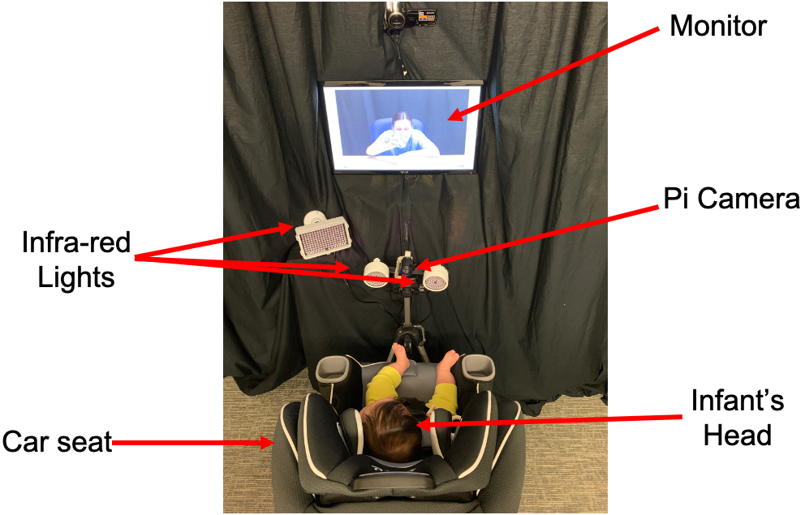
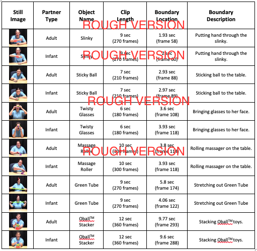
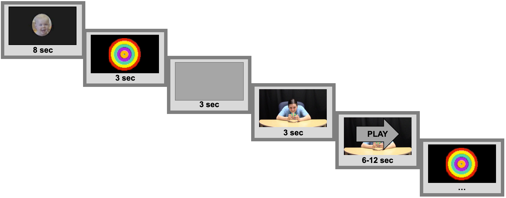

```{r setup, warning = FALSE}
library(papaja)
library(tidyverse)
library(lme4)
library(lmerTest)
library(here)
library(kableExtra)
library(knitr)
library(ggthemes)
library(dplyr)
library(viridis)

```

```{r analysis-preferences}
# Seed for random number generation
set.seed(42)
knitr::opts_chunk$set(cache.extra = knitr::rand_seed, echo = FALSE, warning = FALSE, message = FALSE, cache = FALSE)

# make sure summary() uses Type III sums of squares
afex::set_sum_contrasts()

# turn off scientific notation
options(scipen = 999)

# set plot theme
theme_set(theme_bw() + 
            theme(strip.background = element_blank(), 
                  panel.grid = element_blank())) # nice theme with limited extras
```

```{r load data}

## WILL LOAD DATA HERE

```

# Introduction
Human activity generates a motion stream that is both complex and rapidly unfolding. Making sense of this dynamically streaming sensory information is a challenging cognitive enterprise; actions must be discerned “on the fly” as information flows past. The ability to find structure within unfolding activity (i.e., where individual units of action begin and end) is a key skill that is linked to fluency across domains including learning (Bailey, Kurby, Giovanetti, & Zacks, 2013), memory (Sonne, Kingo, and Krøjgaard, 2016, 2017; Sargent et al., 2013; Flores, Bailey, Eisenberg, & Zacks, 2017), social understanding (Zalla, Labruyére, & Georgieff, 2013), and language acquisition (Levine, Buchsbaum, Hirsh-Pasek, & Golinkoff, 2018). Early in life, infants seem to have acquired the ability to find structure in at least some kinds of activity sequences (see Levine et al., 2018 for a review). Less is known about how infants rise to the challenge of finding this structure as they first encounter novel action and watch it rapidly unfold over time.

It is important to consider, however, that infants are often not alone as they face this challenge. For example, in interactions with infants, caregivers modify their behaviors in a variety of ways that engage infants’ attention and facilitate learning (e.g., Brand, Baldwin, & Ashburn, 2002; Fernald, 1985; Csibra & Gergely, 2009). It seems likely that caregivers’ modifications to infant-directed action (e.g., “motionese;” Brand et al., 2002) could serve specifically to help infants find structure, such as action boundaries, as activity unfolds. As yet this hypothesis remains untested, in part because methods with which to measure infants’ online processing of streaming visual information have rarely been implemented in the action domain. However, the recent development of a novel, open-source, inexpensive, and infant-friendly system for measuring infants’ pupillary response to cognitive stimuli (the Stimulus-Induced Pupil Response (SIPR) system; Patent Pending; Bala, Keller, Whitchurch, Baldwin, & Takahashi, 2016) provides a methodology with which to explore infants’ online processing of visual information. In the present research, we used the SIPR system to explore the extent to which motionese influences infants’ ability to detect action boundaries as activity unfolds across time.

In what follows, we summarize what is currently known about infants’ processing of dynamically unfolding activity as well as initial evidence that caregivers scaffold infants’ processing of human action. Finally, we describe a body of evidence indicating that pupillometry offers potential insight into infants’ processing of dynamically unfolding activity.


## Action processing in infancy
A growing body of literature suggests that action segmentation processes are operative early in life (see Levine et al., 2018 for a recent review). In particular, infants display sensitivity to boundaries in a variety of everyday intentional action sequences (Baldwin, Baird, Saylor, & Clark, 2001; Hespos & Saylor & Grossman, 2009; Saylor, Baldwin, Baird & LaBounty, 2007; Hespos, Grossman, & Saylor, 2010). For example, in seminal work on action segmentation in infancy, Baldwin and colleagues (2001) familiarized 10- and 11-month-old infants to a video depicting an actor engaging in a series of everyday activities. At test, infants were shown the same videos with pauses at action boundaries (i.e., the initiation and completion of intentional action units – like the moment at which one grasps an object to pick it up) or at non-boundary junctures. Infants looked longer to test videos that depicted pauses at non-boundary junctures, suggesting that they readily detect structure in unfolding intentional action, parse human behavior with respect to this structure, and are surprised when this structure is violated.

Recently, Sonne, Kingo, and Krøjgaard (2016) demonstrated that older infants’ memory is influenced by the availability of information about action boundaries, extending findings from previous studies with adults (e.g., Swallow, Zacks, Abrams, 2009; Radvansky & Zacks, 2017; Gold, Flores, & Zacks, 2017). In their research, 16- to 20-month-old infants who had been presented with dynamic activity featuring occlusions at boundaries had weaker memory for the activity, two weeks later, than infants for whom non-boundary regions had been occluded. In an extension of this work, Sonne, Kingo, and Krøjgaard (2017) additionally demonstrated that, at a delay of ten minutes after viewing, 21-month-old infants more accurately remembered specific objects presented at action boundaries than those presented at non-boundary junctures. Apparently infants, like adults, selectively attend to boundaries within unfolding activity. An open question, however, entails just how infants begin to find action boundaries within dynamically unfolding activity sequences.

Statistical learning is one mechanism that seems likely to facilitate infants’ detection of such structure in action. Several lines of evidence suggest that infants use knowledge of predictability structure to guide processing of unfolding activity (e.g., Ambrosini et al., 2013; Kanakogi & Itakura, 2011; Monroy, Gerson, & Hunnius, 2017, NAGAI PREDICTION ERROR REVIEW?). For example, Monroy and colleagues (2017) found that infants not only detected statistical regularities in novel, continuous action sequences, but used these regularities to guide anticipatory gaze on later occasions on viewing the same sequences. As well, infants can capitalize on statistical regularities embedded within novel activity sequences to demarcate units within the unfolding stream (Baldwin, 2012; Roseberry, Richie, Hirsh-Pasek, Golinkoff, & Shipley, 2011; Stahl, Roseberry, Hirsh-Pasek, Romberg, & Golinkoff, 2014). For example, 7- to 9-month-old infants viewed videos of hand movements (Roseberry et al., 2011) or an animated agent performing action sequences (Stahl et al., 2014). As in previous work with adults (e.g., Baldwin, Andersson, Saffran, & Meyer, 2008; Hard, Meyer, & Baldwin, 2018; Swallow & Zacks, XXXX), infants readily discovered units of action within the streaming activity, relying on low-predictability transitions within the stream to define boundaries between action units. 

In sum, infants seem to be sensitive to the internal structure of at least some kinds of everyday activity, and their enhanced memory for activity occurring at boundaries suggests that their processing privileges these regions. Statistical learning is one likely mechanism that enables infants to discover the structure of action over time. However, it is unclear as yet how much or what kind of repeated exposure is necessary before the statistics of a novel activity sequence can be learned and used to guide infants’ subsequent processing. In infants’ day-to-day experience, some contexts might serve to enhance these statistics, promoting infants’ identification of attention-worthy regions of activity (i.e., action boundaries), thereby supporting infants’ rapid acquisition of action processing skill. One particular context that might be especially influential in this regard occurs when caregivers specifically attempt to demonstrate novel activities to infants.


## “Motionese” might scaffold infants’ detection of structure in action.
When demonstrating novel action to infants, caregivers modify their behavior in a variety of systematic ways that seem well suited to promoting infants’ processing of the dynamic activity stream. Recent research investigating this phenomenon provides initial confirmation that infants benefit from such “motionese” demonstrations. It remains unclear, however, whether motionese specifically scaffolds infants’ detection of structure within action, although this seems highly plausible.

A first study documenting motionese found that, when demonstrating novel objects to 6- to 13-month-old infants, caregivers exhibited increased interactiveness, proximity to their infant interactive partner, enthusiasm, range of motion, repetition, and simplicity in their actions (Brand et al., 2002). These modifications capture infants’ attention, in that infants prefer to watch action demonstrations in a motionese format over action characteristic of demonstrations directed toward adults (Brand & Shallcross, 2008). Toddlers are also more likely to imitate actions demonstrated using motionese (Baldwin, Myhr, & Brand, in preparation; Williamson & Brand, 2014), and use of motionese increases 8- to 10-month-old infants’ subsequent object exploration, which can have downstream benefits for overall learning (Koterba & Iverson, 2009).

The motionese modifications just summarized parallel modifications in language directed to infants, commonly called “motherese” (Snow & Ferguson, 1977), and are likely part of a suite of infant-directed modifications jointly constituting a natural pedagogy phenomenon that has received extensive investigation in the developmental literature (Sage & Baldwin, 2010; Csibra & Gergely, 2009). Benefits of motherese in speech include facilitating infants’ attention (Fernald, 1985; ManyBabies, 2020), with subsidiary benefits such as enhancing infants’ processing of the acoustic and segmental properties of speech (Kuhl, 2004), and promoting structure detection within streams of fluent speech (Thiessen, Hill, & Saffran, 2005; Kemler-Nelson, Hirsh-Pasek, Jusczyk, & Cassidy, 1989). 

Given such findings regarding motherese, it seems highly plausible that motionese analogously promotes infants’ detection of structure within activity. In fact, there is existing evidence that certain features of motionese could serve to specifically direct infants’ attention to action boundaries. For example, during object demonstrations to their 7- to 12-month-old infant, mothers’ infant-directed gaze is systematically aligned with boundary junctures (Brand, Hollenbeck, & Kominsky, 2013). Features of mothers’ infant-directed speech during action demonstrations is often aligned with action boundaries as well. For example, the onset and offset of mothers’ action-describing speech tends to be aligned with boundaries occurring at the initiation or completion of an action unit (Meyer, Hard, Brand, McGarvey, & Baldwin, 2013; Hirsh-Pasek & Golinkoff, 1996), and infants tend to group such packaged action into coherent “chunks” (Brand & Tapscott, 2007). At action boundaries, mothers also tend to speak with rising or falling intonation, perhaps signaling the completion of an action unit (Rohlfing, Fritsch, Wrede, & Jungmann, 2006). Features such as repetition (Brand, McGee, Kominsky, Briggs, Gruneisen, & Orbach, 2009) and turn taking (Brand, Shallcross, Sabatos, & Massie, 2007) in infant-directed demonstrations coincide systematically with action boundaries, and may additionally serve to facilitate infants’ attention to the segmental structure of unfolding activity.

All in all, current evidence strongly suggests that motionese may assist infants in detecting action boundaries within continuously flowing activity, which would facilitate learning. For adults, finding structure in activity has downstream benefits for comprehending action (Newtson & Engquist, 1976; Zacks, Tversky, & Iyer, 2001), remembering what has occurred (Sonne et al., 2016, 2017; Swallow et al., 2009), and performing actions oneself (Bailey et al., 2013). Infants’ skill at detecting action boundaries would also promote social understanding (Baldwin & Baird, 2001; Zalla et al., 2013) and language learning (Baldwin, 2005; Levine et al., 2018). [MOVE PAST 2 SENTENCES ELSEWHERE?] As yet, however, the possibility that motionese scaffolds infants’ detection of boundaries within streaming activity has not been put to direct test, largely because most methods used to investigate infant perception and cognition are not well-suited to the task. In particular, existing techniques for investigating infants’ action processing have typically been limited to first exposing infants to action sequences and then, at later test, measuring infants’ recognition/discrimination with respect to the stimuli that they previously viewed (e.g., Woodward, 1998; Baldwin et al., 2001; Stahl et al., 2014). Fortunately, a relatively new technique – measuring ongoing involuntary changes in pupil diameter concomitant with cognitive engagement – offers a novel approach to exploring issues related to infants’ processing of unfolding action. This technique thus offers a novel window on ways in which motionese may scaffold such processing.

## Pupillometry as a promising solution
Pupil dilation response (hereafter PDR) occurs spontaneously with changes in luminance (Loewenfeld, 1993) as well as in response to a variety of cognitive stimuli (Goldwater, 1972; Sirois & Brisson, 2014; Laeng, Sirois, & Gredebäck, 2012). Among other things, changes in pupil dilation are thought to reflect the attentional demands imposed by a cognitive task (Beatty & Lucero-Wagoner, 2000; Goldinger & Papesh, 2012). In general, available findings provide strong confirmation of Kahneman’s (1973) suggestion that pupil diameter provides an online indication of the “intensity of attention” being allocated by an observer. 

Of particular relevance to the present research, one recent study confirms that adults display systematic pupil dilation in relation to the internal structure of activity sequences. Specifically, Tanaka, Kosie, & Baldwin (in preparation) presented adults with a series of short clips of sport activities, each containing one coarse-level action boundary (e.g., when the athlete completed their primary goal, such as striking a tennis ball with a racket during a serve). As predicted, systematic changes in pupil diameter occurred in relation to action boundaries. PDR tended to systematically increase immediately prior to action boundaries, peak at or shortly after boundaries, and return toward baseline over an extended period thereafter. This pattern of response indicates that the PDR methodology offers a window on viewers’ detection of segmental structure within dynamic activity as processing is underway. 

Infancy researchers are also increasingly taking advantage of pupillometry to investigate infant cognition; infants’ PDR profiles have shown a range of similarities to those of adults’ (e.g., Addyman, Rocha, & Mareschal, 2014; Jackson & Sirois, 2009; Sirois & Jackson, 2012; Gredebäck & Melinder, 2010; Hepach & Westermann, 2016).  

Based on this collection of findings, we opted to employ pupillometry to test for boundary-related PDRs as infants viewed novel activity sequences in motionese versus adult-directed formats. We recruited infants in the 9-12 month age range, because prior research has documented both that caregivers produce motionese to infants of this age, and infants in the 9-12 month range are also known to be sensitive to structure in at least some everyday activity streams. We addressed three main questions; these questions and attendant hypotheses and predictions follow: (1) To what extent does infants’ previously-observed preference for “motionese” over adult-directed action replicate via pupillometry (as opposed to standard looking-time measures as utilized in prior research)? (2) To what degree do infants spontaneously display systematic pupil-dilation response to action boundaries within streaming activity? and (3) To what extent does motionese specifically scaffold infants’ detection of action boundaries within continuous activity sequences? 

_To what extent does pupillometry reveal infants’ previously-documented preference for motionese over adult-directed action?_ In pupillometry research, increased arousal manifests in increases in tonic (or sustained) PDR (Kahneman & Beatty, 1966; Laeng et al., 2012). Such sustained increase in PDR to high-arousal social stimuli has been observed across a variety of infant and preschooler research studies (e.g., Hepach, Vaish, & Tomasello, 2012 & 2015; Martineau, Hernandez, Hiebel, Roché, Metzger, & Bonnet-Brilhault, 2011; Geangu, Hauf, Bhardwaj, & Bentz, 2011; Nuske, Vivanti, Hudry, & Dissanayake, 2014 ; Nuske, Vivanti, & Dissanayake, 2015). We therefore predicted that the previously documented looking-time preference for motionese (Brand & Shallcross, 2008) would be reflected in an enhanced tonic PDR to motionese action sequences relative to that observed in relation to the adult-directed action sequences. As a direct replication of previous research, we additionally measured infants’ looking time to motionese and adult-directed activity (i.e., how long infants looked at the videos). Again, we expected to replicate prior research, predicting that infants would look longer to motionese than adult-directed action sequences.

_To what degree do infants spontaneously display a PDR in relation to action boundaries?_ As described earlier, a substantial body of prior evidence indicates that, even in the absence of caregiver scaffolding, infants selectively attend to action boundaries, at least in some kinds of simple, familiar activity sequences (Baldwin et al., 2001; Saylor et al., 2007; Hespos et al., 2009). Interestingly, a study by Jackson and Sirois (2009) provided incidental evidence highlighting the plausibility of this prediction. They measured pupil diameter as infants viewed a train repeatedly entering and exiting a tunnel; infants’ pupil dilation profiles displayed clear signs of a systematic PDR to the juncture at which the train exited the tunnel (that could not be explained by a change in luminance alone), which seems likely to coincide with what adults would judge to be an action boundary. Although investigating infants’ PDR to action boundaries was not the focus of their research, their results nevertheless seem to provide suggestive evidence that infants exhibit a PDR in response to action boundaries, thereby increasing our confidence in predicting that infants would display a systematic PDR to action boundaries in human activity streams.

_To what extent does motionese enhance infants’ detection of action boundaries within continuous activity?_ Speech modifications that are characteristic of motherese have been shown to enhance infants’ ability to extract structure from dynamic streams of auditory stimuli (Thiessen et al., 2005; Kemler-Nelson et al., 1989). On analogy with motherese, motionese also may highlight action boundaries (e.g., Brand et al., 2013; Meyer et al., 2013; Rohlfing et al., 2006; Brand et al., 2009; Brand et al., 2007). We thus expected to find a similar facilitative effect of motionese on infants’ processing of action. That is, we predicted that, while infants would display an enhanced PDR to action boundaries even in the non-motionese condition, there would be a synergistic effect in that an increase in infants’ PDR to boundaries would be larger when actions were demonstrated via motionese relative to adult-directed action. 
To summarize, we predicted a) an overall tonic effect of motionese, such that tonic PDR would be larger for actions demonstrated using motionese over an adult-directed format, b) phasic responses to action boundaries across both motionese and adult-directed demonstrations, but c) larger phasic responses to action boundaries when actions were demonstrated in a motionese than an adult-directed format.

# Methods

```{r participant gender}

# LOAD DATA

```
## Participants
Thirty-six infants ranging from 9 to 12 months (XX females; Mean = XX days; SD = XX days) and their caregivers were recruited to participate from a database of community members with infants. One infant was immediately excluded due to serious medical issues at birth. Race/ethnicity of caregivers and infants was representative of the local community; all participants (XX; XX%) identified as White, XX participants (XX%) additionally identified as Hispanic, XX participant (XX%) additionally identified as Asian, and XX other participant (XX%) additionally identified as Indian or South Asian (caregivers were asked to select all races that applied). To assess socioeconomic status, each family provided information about maternal education (a well-validated proxy for SES that tends to be predictive of developmental outcomes; e.g., Gottfried et al., 2003; Noble et al., 2007; Liaw & Brooks-Gunn, 1994). Mothers in our sample generally reported high educational achievement, with XX% reporting some level of graduate training. After participating, all families received their choice of either a t-shirt or a children’s book as a thank you gift.

## Apparatus
Infants were seated in a car seat approximately 82cm from a black floor-to-ceiling curtain, in front of which was a 58cm wide-screen monitor that presented stimuli at a size of 1920 x 1080 pixels. Infants were strapped into the car seat by the caregiver, and straps were pulled snug to secure infants into the seat. Additionally, the car seat contained padding on either side of the infant’s head, decreasing the amount of head movement that was possible. Infants’ movement was not otherwise restricted. Pupil dilation was digitally recorded via a Raspbery Pi NoIR camera (infrared camera) placed approximately 38cm from the infant’s eyes, just out of reach. Video from the camera was recorded to a Raspberry Pi single-board computer at a rate of 30 frames per second. Two small infrared lights were placed on either side of the Pi camera and a third, larger, infrared light was placed immediately to the left of the Pi camera. These lights helped to illuminate the infant’s face and make the pupils more readily detectible on the resulting video recording. A second SONY video camera was placed above the monitor and zoomed in to gain a close view of the infant’s face. The video file to which this camera recorded was synchronized with the video being played to the infant, resulting in a recording of the infant’s face that also depicted what the infant was seeing. This second video was used for hand coding infants’ looking throughout the pupillometry session. Figure 1 depicts the experimental setup.
```{r fig1, fig.cap="Experimental setup. Infants were seated in a car seat facing a computer monitor. A Raspberry Pi NoIR camera, placed approximately 38cm from infants, recorded their pupillary response to a Raspberry Pi single-board computer. A SONY camera recorded infants’ looking to the screen.", fig.align = "center"}



```
## Stimuli
To investigate the extent to which caregivers’ modifications to infant-directed action (i.e., “motionese”) influenced infants’ processing of dynamic activity sequences, we first created a corpus of videos of infant- and adult-directed action amenable to exploring motionese-related effects. To create the video corpus, we filed 53 infants ranging from 9 to 18 months (29 females; Mean = 403 days; SD = 82.2 days) and their caregivers interacting with a set of toys. Our methods for eliciting infant- and adult-directed action largely paralleled those of Brand and colleagues (2002); caregivers were asked to demonstrate five different set of objects to their own infant and then to another adult (in this case, a research assistant). We selected objects that were likely to maximize caregivers’ use of motionese in demonstrations to their infants. Thus, in line with the majority of previous research on motionese (e.g., Brand et al., 2002; Koterba & Iverson, 2009; Williamson & Brand, 2014; Brand & Shallcross, 2008), we opted to use novel, rather than familiar, objects. For each object, we identified three or four actions that could be done with the object and provided these suggestions to caregivers.

Because PDR is known to be impacted by luminance (e.g., Loewenfeld, 1993), we took a number of steps to minimize the luminance differences across videos, including (a) using blackout film on windows of the study room to ensure that the only light in the room came from the overhead light fixtures, (b) seating all caregivers in the same location, directly under one of the overhead light fixtures, and (c) disabling automatic exposure mode the video camera. We additionally took steps to control for visual differences between caregivers by asking all caregivers to wear the same light blue t-shirt, pull their hair back away from their face, and have just one object of interest on the table at a time.

From this set of newly collected digital videos (infant- and adult-directed action for each caregiver), we chose twelve clips (with six unique objects and six unique caregivers) to be used as stimuli for the pupillometry study. Our goal was to select videos in which infant- and adult-directed action were clearly distinct, while at the same time controlling for extraneous factors that might account for differences in infants’ attention to adult and infant-directed demonstrations. For example, we opted to have the same actor depicted in both the infant- and adult-directed clips involving interaction with the same object. Additionally, because one of our goals was to optimize the chance that each infant in the pupillometry study would attend to multiple presentations of each clip, we opted to keep the clips fairly short (i.e., seven to twelve seconds in length). While we did allow length of the clips to vary across objects, each pair of infant- and adult-directed clips involving a given object were equated in length. Clips were selected and trimmed from full videos such that one major action boundary (such as the moment at which a caregiver finished placing the final item onto a tower) occurred at approximately the same location within a pair of adult and infant-directed demonstrations. See Figure 2 for a detailed summary of the twelve video clips.
```{r fig2, fig.cap="Description of the twelve videos chosen for presentation to infants in the pupillometry study. The figure includes a still frame from each video, information about the interaction partner, the identity of the object, the total length of the video (in seconds and frames), the time at which the boundary occurred (in seconds and frames), and the activity that corresponded to the action boundary. Individuals making boundary judgments were told that the boundary occurred once the actor had finished the listed action.", fig.align = "center"}


```

The twelve video clips chosen for the pupillometry task were then coded for a number of features. First, we demonstrated that there were no significant differences in luminance across the videos that might influence infants’ pupil dilation to infant- versus adult-directed action. Next, we verified, with a naïve group of coders, the location of the one major action boundary in each of the video clips. Additionally, a group of trained undergraduate research assistants coded all videos for the extent to which motionese characteristics were used. The results of this coding validated that the selected infant-directed videos were indeed representative of motionese and that the adult-directed videos were rated relatively lower in motionese features. Finally, we coded videos of infants’ spontaneous looking to, and play with, the objects during the infant interaction task and found no differences in infants’ baseline interest across any of the included objects. Caregivers’ questionnaire responses further supported this finding; infants were relatively unfamiliar with all of the objects. Overall, the resulting set of twelve infant- and adult-directed action video clips seemed appropriate for exploring the effects of motionese on infants’ processing of unfolding activity using the pupillometry methodology. NOTE-do i even need all this detail without reporting data--NOTE

## Design
To avoid effects of familiarity with actors and objects, each infant saw only one video from each pair; that is, they saw either the infant- and adult-directed version of each action on a given object. As a result, each infant viewed six unique videos, three infant-directed and three adult-directed. A set of six videos (three infant-directed, three adult-directed) constituted one “block.” Infants viewed up to six total blocks, thus each infant viewed up to 36 total videos. Because we could not fully counter-balance the videos given our expected sample size, we opted to randomly choose two groups of videos (three infant-directed and three adult-directed in each) and assign an equal number of infants to each group. For each infant, the order of the selected videos was pseudo-randomly assigned such that they never saw more than two infant- or adult-directed videos in a row.

Stimulus presentation was programmed in PsychoPy (Peirce, 2007). As depicted in Figure 3, all blocks started with a brief video of a laughing baby as an attention-getter to help infants orient to the monitor, which played for eight seconds. After the laughing baby attention-getter, a set of moving concentric circles played for three seconds as infants heard a chime sound. The laughing baby and chimes stimuli were acquired via publicly shared materials from the ManyBabies study of infant-directed speech preference (ManyBabies Consortium, 2020). While the laughing baby attention-getter was only played at the start of each block, the circle and chimes attention-getter was played before each video. For three seconds at the beginning of each video, infants were presented with a grey screen signaling the start of the trial. A secondary goal of the grey screen was to match the luminance of the first frame of the video. [FOOTNOTE: Due to an inadvertent change in luminance of the grey screen during stimulus creation, this goal was not satisfied. However, because we were not specifically interested in infants’ PDR to content immediately following the grey screen, this issue was not problematic for interpretation of our results (and is thus explained in further detail in supplementary materials).] After the grey screen, infants were presented with a three-second still image depicting the first frame of the action sequence. The still image was included to allow infants’ pupils to adapt to both the luminance and the characteristics (e.g., featured actor and object) of the visual scene that would be viewed in the upcoming video. After the three-second still, the action sequence began to play silently at a standard rate of 30 frames per second. Upon completion of a trial, the infant again heard the chimes while viewing the concentric circles, and then the next trial started with a grey screen followed by a still frame. Once infants had completed their six unique trials the laughing baby played again, starting the next block. This repeated for a total of six blocks or until the infant became too fussy to continue.
```{r fig3, fig.cap="This figure depicts the structure of the pupillometry experiment. Each block started with a laughing baby attention-getter. Infants then heard chimes while viewing concentric circles. At the start of each trial, infants viewed a grey screen for 3s and then the first frame of the video for 3 seconds. After this, the video silently played in its entirety. Infants viewed the circles/chimes between each trial. Six trials constituted a single block, and each block repeated a maximum of six times.", fig.align = "center"}



```
## Procedure
Caregivers were seated shoulder-to-shoulder with the infant, but facing away from the monitor. This setup allowed infants to see the caregiver should they look over, but avoided the possibility that infants would be influenced by any caregiver reaction to the stimuli. Caregivers were asked to remain facing away from the monitor and not to interact with the infant. We requested that, if the infant started to fuss, they simply put their hand on the infant. However, if at any point they wanted to take a break or stop the experiment, they should feel free to let us know and we would stop immediately. Once the caregiver and infant were seated, the experimenter adjusted the focus of the Raspberry Pi NoIR camera to ensure a clear picture of the infant’s pupil. She then went behind the curtain and began the pupillometry session. If infants completed the entire set of six blocks, this part of the session lasted approximately 12 minutes. 

## Inclusion Criteria
As mentioned previously, each block of videos contained six unique trials, each trial depicting a unique motionese or adult-directed action sequence. Infants had the opportunity to view six total blocks of videos, each containing the same six trials (i.e., activity sequences). Trials were considered unusable if the infant was fussy (as coded by the experimenter) and/or not looking at the screen for at least 50% of the trial. The number of unusable trials was approximately equal for motionese and adult-directed activity. An entire block (i.e., one presentation of the six videos) was dropped from analysis if an infant’s data were unusable on more than 50% of trials within the block. All infants in the current study contributed at least one block of data, thus none were completely excluded from analyses. In total, XX trials across XX infants were included in the pupillometry analyses. The median number of trials contributed by each infant was XX (out of 36 total possible trials). 

## Data acquisition
NOTE-simplify or move this to supporting materials-NOTE We recorded a separate video for each infant via the Raspberry Pi NoIR camera and Raspberry Pi computer. Each video was run through a Matlab (Matlab, 2019) pupil detection program designed to advance frame-by-frame through the video, find circles, and measure their diameter. First, the Matlab program read in all of the frames from the video file and stored them in memory. At this time, we also synchronized the videos collected from the Pi Camera and the stimulus presentation in PsychoPy (Pierce, 2007). We next defined a number of additional parameters, specific to each video, that enabled the Matlab (Matlab, 2019) program to detect and measure circles. The first step in calculating pupil diameter was to manually examine the video to determine which of the infants’ eyes was visible most frequently throughout the video. We defined that eye as the one that the program should detect and for which it should measure pupil diameter. If, for example, we chose the left eye, the program would calculate the diameter of the circle that was closest to the left side of the image. While this usually meant that the diameter corresponded to the left eye, occasionally infants moved their heads and the left eye was not visible on the screen. If the right eye was visible at these moments, it would become the left-most circle on the screen and thus the diameter of the right pupil would be calculated (note that right and left eye pupil dimeter are strongly correlated; Jackson & Sirois, 2009; Sirois & Jackson, 2012). We next set a number of metrics that enabled the Matlab program to detect and measure pupils. To set these metrics, we selected one frame at random for which the infant’s pupil was clearly visible. First, we set a threshold for each participant for how dark a pixel had to be to remain black, and all pixels in the frame that were not at least as dark as that value became white. After pushing the image to threshold, we used the Matlab Data Cursor to measure infants’ pupil size in the randomly-selected sample image, and we referenced this measurement to set limits for the size of circles to be detected (setting limits too low would allow for things like the infants’ nostrils to be detected as circles, while setting limits too high would, in some cases, include things like the infant’s hair being considered a circle). We additionally set a sensitivity metric; this metric specified how precise the shape and size of a potential pupil image on a given frame had to be to consider that shape a circle, and thus to calculate a pupil diameter. With these metrics, we detected pupils for one image and plotted, over the image, a red circle that indicated the circles that had been detected and measured. This allowed us to visually assess how well the metrics that were set corresponded to the pupils visible in the image. After setting these metrics for one frame in the video sequence, we randomly selected ten additional frames to validate that these metrics were able to detect pupils throughout the video sequence. Again, for each of these frames, we plotted the circles that were detected over an image of the infants’ pupils and visually examined. The values chosen for these settings for each participant are available on the OSF page associated with this dissertation (http://osf.io/8mzhf). Once these metrics were set and verified, the program automatically used them to calculate pupil diameter for each frame in the video recorded by the Raspberry Pi camera.

We next turned to decisions regarding data interpolation, z-scoring, filtering, and baseline correcting. This presented a challenge as, in the field of infant pupillometry research, there is a lack of consistency across studies in the implementation of preprocessing steps (Geller, Winn, Mahr, & Mirman, 2019; Hepach & Westermann, 2016; Mathôt, Fabius, Van Heusden, & Stigchel, 2018). Thus, rather than follow one specified procedure for pupillometry analyses, we examined prior research to make informed decisions about the preprocessing steps that were most appropriate for the current study. 

Following previous research using this pupillometry system (Bala et al., 2016) as well as that of other experts in pupillometry research (e.g., Unsworth & Robinson, 2015; Miller, Gross, & Unsworth, 2019), we opted not to interpolate missing values and thus preserve the original data to the extent possible. We did, however, engage in a number of data manipulation procedures in an effort to render the data more interpretable and comparable across subjects. First, we z-scored pupil size measurements for each participant. To calculate z-scores, we included all relevant frames for each participant (i.e., data from the grey screen, still frame, and video across all blocks and trials but ignoring responses to the attention-getting stimuli) and used these same z-scored data across all analyses. Specifically, we calculated the mean and standard deviation of pupil size for each participant (across all blocks and trials), subtracted the individual’s mean from their pupil diameter at each frame, and divided this value by that individual’s standard deviation. Z-scoring was done for the following reasons: (1) the Matlab program records pupil diameter in pixel size, which is dependent on features of the Pi video (e.g., the degree of zoom on the infants pupil) thus z-scoring made the pupil size measurements more comparable across participants, (2) z-scoring both pupil diameter and luminance makes these measurements more interpretable and more easily comparable as well, and (3) z-scoring controls for individual baseline pupil size differences across subjects, while (4) preserving within-participant pupil diameter differences across motionese and adult-directed action.

After z-scoring, the raw pupil values were filtered to eliminate random fluctuations in the data. While there are multiple possible filters that can be used to smooth pupillometry data (see Hepach & Westermann, 2016 for a review in infancy research), we opted to use a hanning filter with a standard window size of 11 frames. We chose this filter for several reasons. For one, the hanning filter uses a moving average, which is one of the common ways of filtering data in pupillometry research and is among those suggested by the creators of R packages for analyzing pupillometry data (e.g., Hepach & Westermann, 2016; Geller et al., 2019). Additionally, the hanning filter can handle missing data, enabling us to perform pupillometry analysis without first interpolating missing values due to blinks or “look aways.” Finally, a visual comparison of filtered and unfiltered data suggested that the hanning filter would appropriately preserve effects of interest while removing extreme values. The hanning filter uses a weighted moving average by generating a normal distribution of weights centered on the frame being filtered and encompassing the surrounding 10 frames (when the window is set at 11, which is the standard, recommended window in pupillometry research). Because of this distribution of weights, the frame of interest has the largest influence on the filtered pupil value, the frames on either side have the next largest influence, and the amount of influence decreases until the distribution covers 11 total frames. Frames outside this window do not contribute to the estimate of pupil size. The z-scored, filtered data are referred to simply as “pupil size” for the remainder of this manuscript.

After filtering the data, we generated baseline-corrected values for each participant on each trial. Our measurement of baseline was the average pupil diameter in the one second region before onset of the video, calculated separately on each trial. This baseline was chosen for two reasons. First, on viewing infants’ pupil diameter to the grey screen, still frame, and start of the video, it appeared that there was a large luminance effect when the grey screen changed to the still frame. This luminance effect appeared to take about two seconds (of the three-second still frame) to begin to recover. Thus, the final one second of the still frame seemed to be the most appropriate baseline measurement. Secondly, while there is no real consensus across pupillometry research in how to choose a baseline value, the one second before stimulus onset baseline has been used in a number of infant pupillometry studies (e.g., Geangu et al., 2011; Hepach & Westermann, 2013; Morita et al., 2012, Nuske et al., 2015). In line with methods used by Tanaka and colleagues (in preparation), we opted to control for baseline in analyses via covariation rather than correct for baseline via subtracting or dividing pupil sizes by baseline pupil size. Both subtracting or dividing pupil size by a baseline value have the disadvantage that, when infants’ pupils are large at baseline, the degree of possible change as they view the videos would be attenuated and therefore it would be harder to detect stimulus effects.

# Results

# Discussion
To briefly review, we first performed a number of “validity checks” on the data to help validate the novel pupillometry methodology. We found expected patterns of reduction in infants’ looking across trials. As well, PDR patterns generally conformed to predictions in response to the still frame and video onsets. Additionally, we found strong correspondence between Pi/Matlab-coded and hand-coded looking, suggesting that the Pi camera and Matlab program accurately detected pupils during moments at which infants were looking at the screen. 
We then explored the extent to which infants preferred to view motionese over adult-directed demonstrations, using both looking time and pupil size measures. Previous studies (e.g., Brand & Shallcross, 2008) found that infants prefer to view motionese over adult-directed demonstrations, and looking time means to motionese versus adult-directed videos in the present study trended this way, though the difference was not statistically significant. In particular, neither infants’ looking, nor their pupil size were significantly greater in response to motionese demonstrations. 

A subsequent set of analyses examined whether infants displayed a PDR to major action boundaries across the videos, as previously documented for adults by Tanaka and colleagues (in preparation). We measured infants’ pupil size during pre-boundary, boundary, and post-boundary regions of unfolding activity sequences. Overall, infants’ pupil diameter did not differ across pre-boundary, boundary, and post-boundary regions. However, when action was presented in a motionese format, infants’ pupils displayed systematic increase in boundary relative to pre-boundary regions, and then remained high afterwards. Thus, infants indeed displayed a boundary-related PDR as was previously observed in adults, but for infants this was only the case for motionese demonstrations, supporting our prediction that motionese facilitates infants’ detection of segmental structure within unfolding activity sequences. 

Finally, we explored the influence of motionese on infants’ interaction with novel objects. Overall, while we found some differences in infants’ preference for objects, no single object stood out as being overwhelmingly preferred. These findings are consistent with those reported in Chapter II. Additionally, during only the three-second “looking alone” phase, infants looked significantly longer at the object that had been demonstrated in the adult-directed demonstration. One possible explanation is that this was the result of a novelty preference – because infants were more interested in motionese videos, objects presented in adult-directed videos were more novel. However, this difference was not replicated in any of our other measures of infant interest, and we are thus cautious about interpreting this effect.

Regarding the “validity check,” analyses overall increased confidence that the novel pupillometry methodology used in this research detected pupils appropriately and accurately measured infants’ pupil diameter. One unexpected effect, the observation that pupil diameter was larger before the onset of the still frame, can likely be explained by luminance-related responding. Our original plan was to match the overall average luminance of the grey screen to the overall average luminance of the first frame in the video. Unfortunately, we subsequently learned that the luminance of the grey screen was altered due to video compression when combining the grey screen, still frame, and video files, and was not actually matched in luminance to the still frame in the stimuli viewed by infants (this issue is described in detail in the supplementary material). Although the PLR observed to the onset of the still frame after the grey screen was not predicted, it nevertheless was a sensible outcome given that the still frames displayed luminance increases relative to the grey screen, especially in certain regions of the video (e.g., the actor’s face or shirt). Also sensible was the pattern of increases in pupil-diameter as the still images transitioned to the videos (i.e., when the motion began). Finally, analyses comparing Pi/Matlab-coded versus hand-coded looking behavior increased confidence in the results reported here, as well as providing important validation of this relatively new pupillometry technology used with streaming visual stimuli.

A collection of analyses examined our first major research question: whether infants would prefer motionese over adult-directed action. One perspective on the outcome of these analyses is that we failed to replicate this previously observed preference (e.g., Brand & Shallcross, 2008), in that we found no difference in infants’ looking duration nor in their average pupil size in response to infant- versus adult-directed demonstrations. Another, perhaps more nuanced, perspective on our pattern of findings is that we observed several hints of a motionese preference, but a “ceiling effect” created by infants’ overall very high level of interest in the videos (they looked at the videos 93% of each trial on average) may have undercut the sensitivity of our method to such a preference. In support of this more nuanced perspective, we found that infants displayed longer average looking to motionese relative to adult-directed videos for five of the six videos, and we also found a trend for motionese looking to increasingly exceed adult-directed action-looking across blocks as the study proceeded, presumably because the ceiling effect progressively attenuated. In Chapter IV we discuss further possible causes of a ceiling effect and thoughts about how to ameliorate it in future studies.

It is of course also possible that our methodology was insensitive to a motionese preference in other respects. For example, it is worth noting that the method used in the original study (Brand & Shallcross, 2008) demonstrating that infants prefer to look at motionese over adult-directed action was a preferential looking task. Infants were shown two videos, one adult-directed and the other infant-directed, and experimenters assessed which of the two videos infants looked to more. In contrast, we showed infants only one video at a time. Presenting a single stimulus was necessitated by the range of research questions we were addressing in this research. However, it is nevertheless possible that the preferential looking method is better suited to detecting such a preference than the single stimulus method we employed. Likewise, had we used an infant-controlled version of the single-screen procedure (used in some research documenting infants’ preference for motherese over adult-directed speech; e.g., ManyBabies Consortium, under revision) rather than the fixed-timing version we opted for, we also might have observed a more systematic motionese preference. 

Another collection of analyses addressed our second and third questions: whether infants would display a PDR in response to major action boundaries, and whether motionese would facilitate such boundary-related responding. As it turned out, a significant boundary effect – increased pupil diameter during boundary regions – was observed, but only for motionese demonstrations. These findings suggest that motionese indeed enhance infants’ detection of segmental structure in unfolding activity. It is worth noting, however, that infants’ boundary-related PDR differed in other ways from the comparable pattern observed in one previous study with adults. For one thing, infants’ boundary-related PDR during motionese demonstrations was slower (occurring on average within a one-second region after the boundary) than adults’ (occurring on average within a half-second region after the boundary). This was consistent with other evidence that infants’ pupil response is generally slower than adults’ (e.g., Verschoor et al., 2013, 2015; Zhang et al., 2019). Another difference was that a linear trend provided the best characterization of infants’ boundary-related PDR; in contrast, while Tanaka and colleagues (in preparation) did find both significant linear and quadratic trends, the quadratic trend was stronger and suggested that adults’ pupil diameter began to return to baseline shortly after their boundary-related PDR. Why might infants’ pupil diameter remain high after the boundary? One likely explanation is again, that infants’ pupil response – including the return to baseline – may simply be slower than adults’. Also, as we observed from visual examination of the videos, there was often considerable post-boundary movement in infant-directed demonstrations. Upon examination of the videos, we observed that caregivers depicted in the videos frequently did things like spreading their arms to exaggerate the fact that a boundary had occurred. Often caregivers would also make excited and exaggerated facial expressions after finishing a unit of action. These features of the stimuli are of course characteristic of motionese, and could serve to sustain infants’ arousal, thereby reducing a tendency for pupil diameter to return to baseline levels after a boundary. In an exploratory analysis, we found some evidence that the boundary effect emerges across time, with the boundary-related PDR gaining systematicity after several viewings. This is consistent with previous research conducted in our lab (e.g., Kosie & Baldwin, 2019a) and suggests possible reorganization of attention across repeated viewing of novel activity sequences. 

Regarding luminance, we considered the possibility that luminance patterns might have influenced our results. While we took a number of steps to control for luminance across our videos (described in detail in Chapter II), luminance for motionese demonstrations was high pre- and post-boundary, and lower within the boundary region. In the pupillometry results, we observed larger pupil diameter during the boundary region and smaller pupil diameter during the pre-boundary region. These PDR results would generally correspond to the observed patterns of luminance; however, there were a few reasons why luminance did not seem to offer a sole explanation for differences in pupil size across regions. For one, the change in luminance across our videos was smaller than would be expected to significantly influence an observers’ pupil diameter (Bala, unpublished data). Additionally, we directly controlled for luminance in many of our analyses. Luminance itself was not a significant predictor of pupil size, nor did controlling for luminance influence the relationship between video region (pre-boundary, boundary, post-boundary) and pupil size. Finally, as mentioned previously, luminance was larger pre- and post-boundary than at the boundary itself, but the biggest difference in luminance was the difference from boundary to post-boundary. In contrast, we found that infants’ pupil size increased at the boundary and remained high post-boundary. If luminance alone influenced infants’ pupil diameter, we would expect a constriction post boundary, and this was not observed. Thus, there is strong evidence that our pupil-related effects cannot be explained simply by video luminance.

Taken together, the results of these analyses suggest that motionese promotes infants’ detection of major action boundaries within unfolding action. While we did not find an overall motionese preference reflected in infant looking or infant pupil diameter, we believe that the current stimuli were not well-suited to find this effect. Suggestions for changes to be implemented in future research are discussed in Chapter IV. However, while infants’ PDR was not indicative of enhanced attention to action boundaries in adult-directed activity sequences, a boundary advantage (increased PDR at action boundaries) emerged when they viewed motionese action. In addition to providing the first demonstration that motionese enhances infants’ online action processing, this research further validated the use of a new, inexpensive, open-source, and infant-friendly methodology for measuring infants’ attention to streaming visual stimuli. 


\newpage

# References
```{r create_r-references, include = FALSE}
r_refs(file = "r-references.bib")
```

\begingroup
\setlength{\parindent}{-0.5in}
\setlength{\leftskip}{0.5in}

<div id = "refs"></div>
\endgroup
